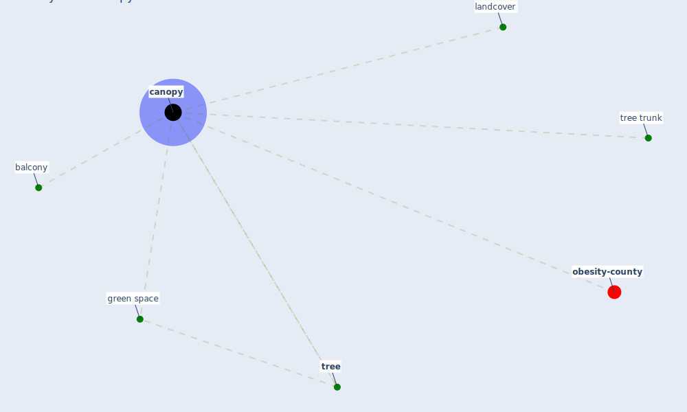

# Keyword: canopy

* [obesity-county](cluster_9)

## Keywords

 * Cluster_9, [balcony](keyword_balcony), canopies, [canopy](keyword_canopy), [green space](keyword_green_space), landcover, [tree](keyword_tree), tree trunk

## Mapping

## Neighbours

### Closest articles

* Treating two pandemics for the price of one: Chronic and infectious disease impacts of the built and natural environment - [LINK](article_frank_treating_2021)
* Green spaces, especially forest, linked to lower SARS-CoV-2 infection rates: A one-year nationwide study - [LINK](article_jiang_green_2021)
* Biophilic design in architecture and its contributions to health, well-being, and sustainability: A critical review - [LINK](article_zhong_biophilic_2022)
* Questioning the use of the balcony in apartments during the COVID-19 pandemic process - [LINK](article_aydin_questioning_2020)

### Closest BPs

