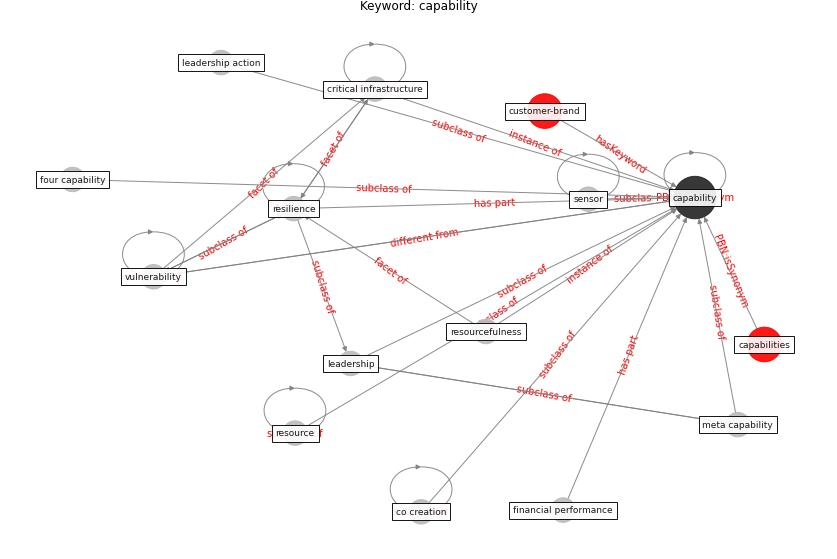

# Keyword: capability

* [customer-brand](cluster_Cluster_8)

## Keywords

 * Cluster_8, capabilities, [capability](keyword_capability), co creation, [critical infrastructure](keyword_critical_infrastructure), financial performance, four capability, leadership, leadership action, meta capability, [resilience](keyword_resilience), [resource](keyword_resource), resourcefulness, [sensor](keyword_sensor), [vulnerability](keyword_vulnerability)

## Concepts

 

## Neighbours

### Closest articles

* How COVID-19 Could Accelerate the Adoption of New Retail Technologies and Enhance the (E-)Servicescape - [LINK](article_willems_how_2021)
* A review of definitions and measures of system resilience - [LINK](article_hosseini_review_2016)
* COVID-19 as a Harbinger of Transforming Infrastructure Resilience - [LINK](article_carvalhaes_covid-19_2020)
* Strengthening resilience: a priority shared by Health 2020 and - [LINK](article_who_strengthening_2017)
* Scalable IoT Architecture for Monitoring IEQ Conditions in Public and Private Buildings - [LINK](article_calvo_scalable_2022)

### Closest BPs

