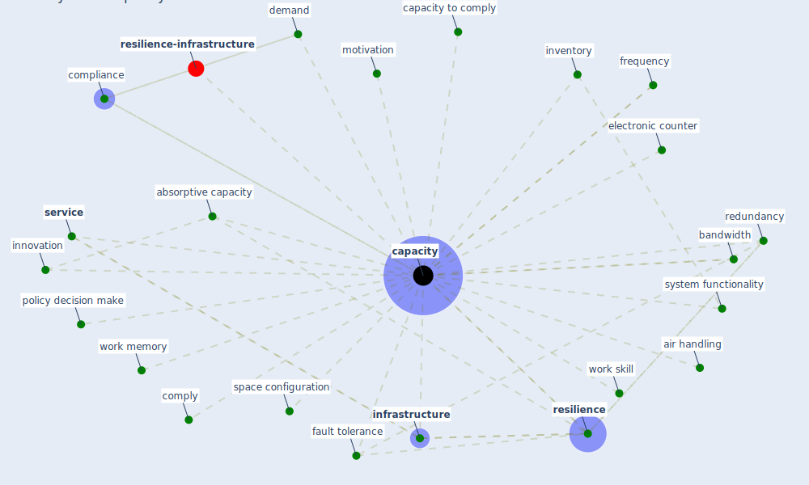

# Keyword: capacity

* [resilience-infrastructure](cluster_11)

## Keywords

 * Cluster_11, absorptive capacity, air handling, bandwidth, capacities, [capacity](keyword_capacity), capacity to comply, [compliance](keyword_compliance), comply, demand, electronic counter, fault tolerance, frequency, [infrastructure](keyword_infrastructure), [innovation](keyword_innovation), inventory, motivation, policy decision make, redundancy, [resilience](keyword_resilience), [service](keyword_service), space configuration, system functionality, work memory, work skill

## Mapping

## Neighbours

### Closest articles

* Compliance with COVID-19 Mitigation Measures in the United States - [LINK](article_van_rooij_compliance_2020)
* COVID-19 and a new resilient infrastructure landscape - [LINK](article_oecd_covid-19_2021)
* Mobility Behaviour in View of the Impact of the COVID-19 Pandemic—Public Transport Users in Gdansk Case Study - [LINK](article_przybylowski_mobility_2021)
* A review of definitions and measures of system resilience - [LINK](article_hosseini_review_2016)
* Sustainable work throughout the life course: National policies and strategies, Publications Office of the European Union - [LINK](article_eurofund_sustainable_2016)
* Designing a Multi-Agent Occupant Simulation System to Support Facility Planning and Analysis for COVID-19 - [LINK](article_lee_designing_2021)
* Assessment of COVID-19 precautionary measures in sports facilities: A case study on a health club in Saudi Arabia - [LINK](article_ibrahim_assessment_2022)
* The Intelligent Lockdown: Compliance with COVID-19 Mitigation Measures in the Netherlands - [LINK](article_kuiper_intelligent_2020)
* A Review on Building Design as a Biomedical System for Preventing COVID-19 Pandemic - [LINK](article_amran_review_2022)
* Guidelines for resilience systems analysis - [LINK](article_oecd_guidelines_2014)

### Closest BPs

