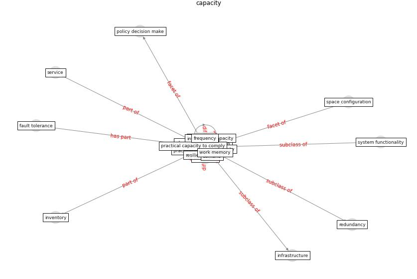

# Keyword: __capacity__
## Clusters

* Cluster 9: [resilience-infrastructure](cluster_9)

## Concepts

 

## Articles
* Mobility Behaviour in View of the Impact of the
COVID-19 Pandemic—Public Transport Users in
Gdansk Case Study ([przybylowski_mobility_2021](article_przybylowski_mobility_2021))
* oecd_covid-19_2021 ([oecd_covid-19_2021](article_oecd_covid-19_2021))
* p15-lee-vor ([p15-lee-vor](article_p15-lee-vor))
* Designing a Multi-Agent Occupant Simulation
System to Support Facility Planning and Analysis
for COVID-19 ([lee_designing_2021](article_lee_designing_2021))
* eurofund_sustainable_2016 ([eurofund_sustainable_2016](article_eurofund_sustainable_2016))
* Assessment of COVID-19 precautionary measures in sports
facilities: A case study on a health club in Saudi
Arabia ([ibrahim_assessment_2022](article_ibrahim_assessment_2022))
* oecd_guidelines_2014 ([oecd_guidelines_2014](article_oecd_guidelines_2014))
* A Review on Building Design as a Biomedical
System for Preventing COVID-19 Pandemic ([amran_review_2022](article_amran_review_2022))
* A review of definitions and measures of system
resilience ([hosseini_review_2016](article_hosseini_review_2016))
* COVID-19 Could Leverage a Sustainable Built
Environment ([pinheiro_covid-19_2020](article_pinheiro_covid-19_2020))
