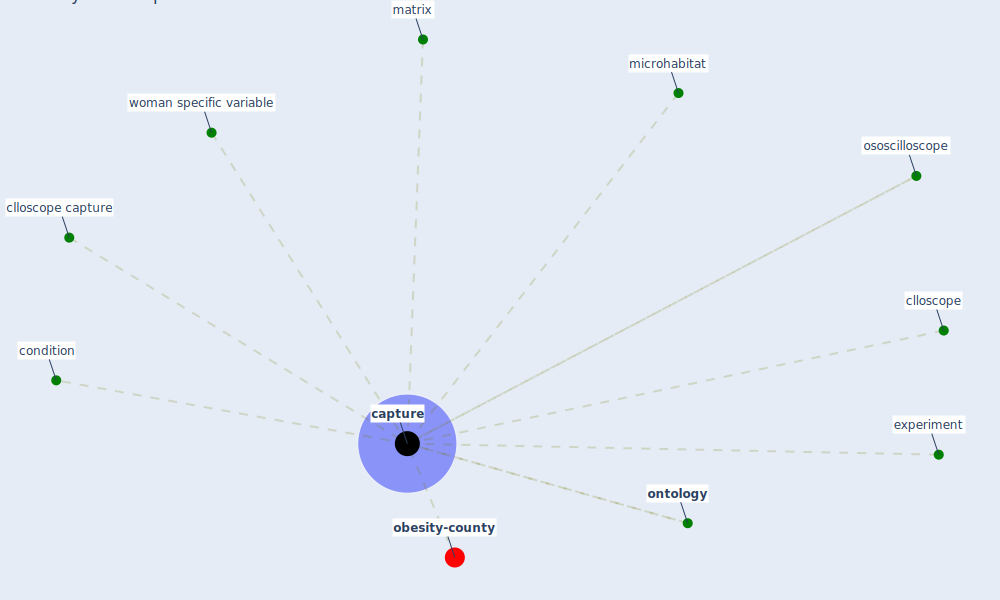

# Keyword: capture

* [obesity-county](cluster_9)

## Keywords

 * Cluster_9, [capture](keyword_capture), captured, clloscope, clloscope capture, condition, experiment, matrix, microhabitat, [ontology](keyword_ontology), ososcilloscope, woman specific variable

## Mapping

## Neighbours

### Closest articles

* Scalable IoT Architecture for Monitoring IEQ Conditions in Public and Private Buildings - [LINK](article_calvo_scalable_2022)
* Green infrastructure through the lens of “One Health”: A systematic review and integrative framework uncovering synergies and trade-offs between mental health and wildlife support in cities - [LINK](article_felappi_green_2020)
* The ventilation of buildings and other mitigating measures for COVID-19: a focus on wintertime - [LINK](article_burridge_ventilation_2021)
* An Overview of Biomedical Ontologies for Pandemics and Infectious Diseases Representation - [LINK](article_bayoudhi_overview_2021)
* COVID-19 and the rise of intimate partner violence - [LINK](article_aguero_covid-19_2021)

### Closest BPs

