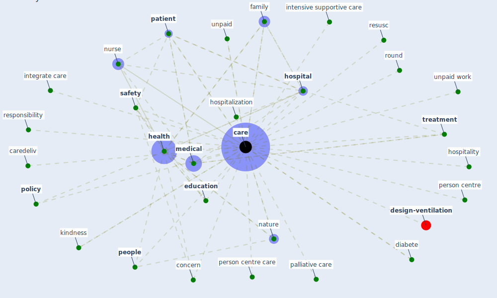

# Keyword: care

* [design-ventilation](cluster_12)

## Keywords

 * Cluster_12, [care](keyword_care), caredeliv, caring, concern, critical, [diabete](keyword_diabete), [education](keyword_education), elderly, family, [health](keyword_health), [hospital](keyword_hospital), hospitality, hospitalization, integrate care, intensive supportive care, kindness, [medical](keyword_medical), [nature](keyword_nature), [nurse](keyword_nurse), palliative care, [patient](keyword_patient), [people](keyword_people), person centre, person centre care, [policy](keyword_policy), responsibility, resusc, round, [safety](keyword_safety), [treatment](keyword_treatment), unpaid, unpaid work, volunteer

## Mapping

## Neighbours

### Closest articles

* Sustainable work throughout the life course: National policies and strategies, Publications Office of the European Union - [LINK](article_eurofund_sustainable_2016)
* Management of the COVID-19 pandemic: challenges, practices, and organizational support - [LINK](article_hossny_management_2022)
* COVID-19 Could Leverage a Sustainable Built Environment - [LINK](article_pinheiro_covid-19_2020)
* Occupant health in buildings: Impact of the COVID-19 pandemic on the opinions of building professionals and implications on research - [LINK](article_awada_occupant_2022)
* How will COVID-19 change future building regulations? - [LINK](article_hmc_architects_how_2020)
* How COVID-19 Could Accelerate the Adoption of New Retail Technologies and Enhance the (E-)Servicescape - [LINK](article_willems_how_2021)
* Biophilic design in architecture and its contributions to health, well-being, and sustainability: A critical review - [LINK](article_zhong_biophilic_2022)
* Health, Economic and Social Development Challenges of the COVID-19 Pandemic: Strategies for Multiple and Interconnected Issues - [LINK](article_panneer_health_2022)
* Sustainability of Coronavirus on Different Surfaces - [LINK](article_suman_sustainability_2020)
* Urban planning after COVID-19 - [LINK](article_rtpi_urban_2021)

### Closest BPs

