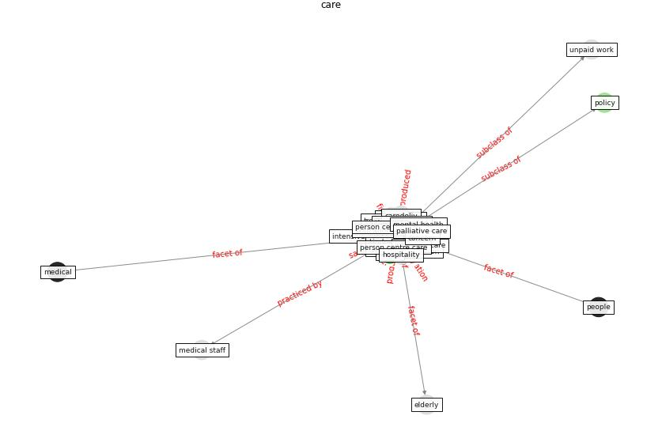

# Keyword: __care__
## Clusters

* Cluster 1: [health-ai](cluster_1)

## Concepts

 

## Top 10 articles for __care__
* eurofund_sustainable_2016 ([eurofund_sustainable_2016](article_eurofund_sustainable_2016))
* How COVID-19 Could Accelerate the Adoption of
New Retail Technologies and Enhance the
(E-)Servicescape ([willems_how_2021](article_willems_how_2021))
* COVID-19 Could Leverage a Sustainable Built
Environment ([pinheiro_covid-19_2020](article_pinheiro_covid-19_2020))
* Management of the COVID-19 pandemic: challenges,
practices, and organizational support ([hossny_management_2022](article_hossny_management_2022))
* Occupant health in buildings: Impact of the COVID-19
pandemic on the opinions of building professionals and
implications on research ([awada_occupant_2022](article_awada_occupant_2022))
* hmc_architects_how_2020 ([hmc_architects_how_2020](article_hmc_architects_how_2020))
* who_strengthening_2017 ([who_strengthening_2017](article_who_strengthening_2017))
* rtpi_urban_2021 ([rtpi_urban_2021](article_rtpi_urban_2021))
* The socio-economic determinants of COVID-19: A spatial
analysis of German county level data ([ehlert_socio-economic_2021](article_ehlert_socio-economic_2021))
* Navigating Climate Change: Rethinking the Role of
Buildings ([cole_navigating_2020](article_cole_navigating_2020))
