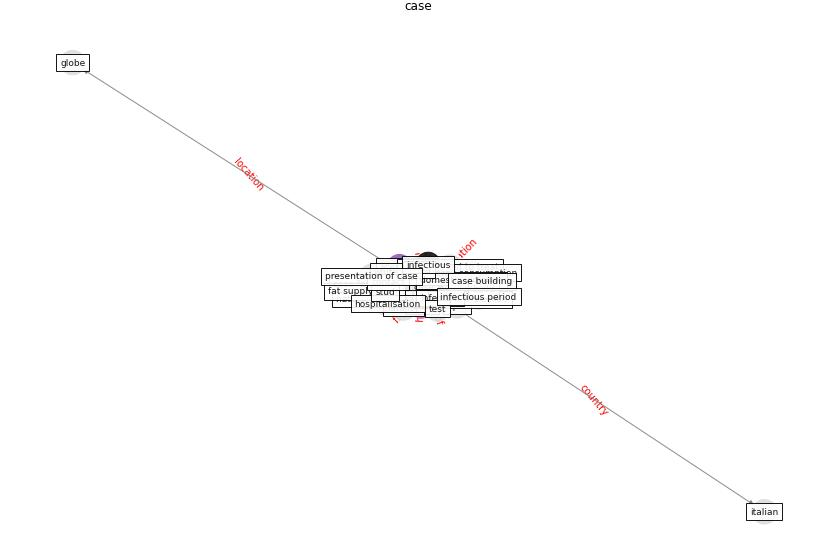

# Keyword: __case__
## Clusters

* Cluster 1: [health-ai](cluster_1)
* Cluster 7: [liver-province](cluster_7)
* Cluster 12: [wastewater-sars](cluster_12)
* Cluster 15: [water-wastewater](cluster_15)

## Concepts

 

## Top 10 articles for __case__
* The effect of occupant distribution on energy consumption
and COVID-19 infection in buildings: A case study of
university building ([mokhtari_effect_2021](article_mokhtari_effect_2021))
* Role of Information Technology in Covid-19
Prevention ([mehtab_alam_role_2021](article_mehtab_alam_role_2021))
* The effect of a redesigned floor plan, occupant density
and the quality of indoor climate on the cost of space,
productivity and sick leave in an office building–A
case study ([saari_effect_2006](article_saari_effect_2006))
* Learning from pandemics: Applying resilience thinking to
identify priorities for planning urban settlements ([syal_learning_2021](article_syal_learning_2021))
* An Overview of Biomedical Ontologies for Pandemics
and Infectious Diseases Representation ([bayoudhi_overview_2021](article_bayoudhi_overview_2021))
* What has been the impact of the COVID-19 pandemic on
immigrants? An update on recent evidence ([oecd_what_2022](article_oecd_what_2022))
* rtpi_urban_2021 ([rtpi_urban_2021](article_rtpi_urban_2021))
* COVID-19 Prevention and Control Measures in
Workplace Settings: A Rapid Review and
Meta-Analysis ([ingram_covid-19_2021](article_ingram_covid-19_2021))
* Management of the COVID-19 pandemic: challenges,
practices, and organizational support ([hossny_management_2022](article_hossny_management_2022))
* When the fourth water and digital revolution encountered
COVID-19 ([poch_when_2020](article_poch_when_2020))
