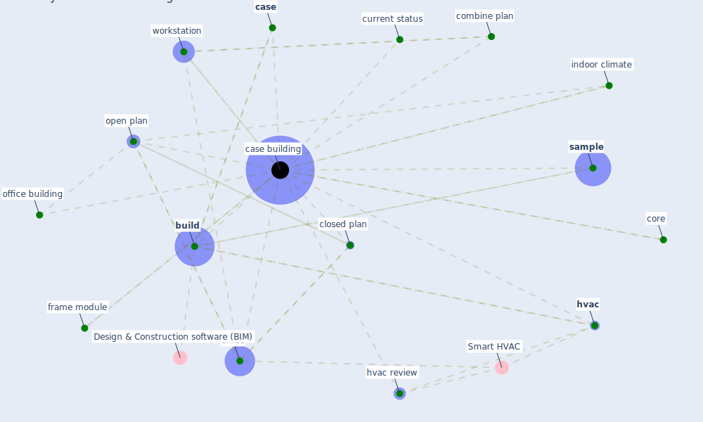

# Keyword: case building

## Keywords

 * [build](keyword_build), [case](keyword_case), [case building](keyword_case_building), closed plan, combine plan, core, current status, frame module, [hvac](keyword_hvac), hvac review, [indoor climate](keyword_indoor_climate), office, office building, open plan, [sample](keyword_sample), [workstation](keyword_workstation)

## Mapping

## Neighbours

### Closest articles

* The effect of a redesigned floor plan, occupant density and the quality of indoor climate on the cost of space, productivity and sick leave in an office building–A case study - [LINK](article_saari_effect_2006)

### Closest BPs

