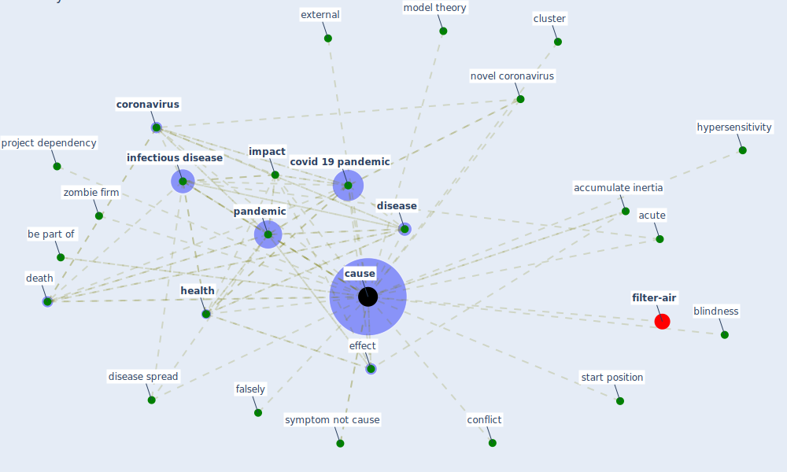

# Keyword: cause

* [filter-air](cluster_0)

## Keywords

 * Cluster_0, accumulate inertia, acute, be part of, blindness, [cause](keyword_cause), causes, cluster, conflict, [coronavirus](keyword_coronavirus), [covid 19 pandemic](keyword_covid_19_pandemic), death, [disease](keyword_disease), disease spread, effect, external, falsely, [health](keyword_health), hypersensitivity, [impact](keyword_impact), [infectious disease](keyword_infectious_disease), model theory, novel coronavirus, [pandemic](keyword_pandemic), project dependency, start position, symptom not cause, zombie firm

## Mapping

## Neighbours

### Closest articles

* Influence between COVID-19 Impacts and Project Stakeholders in Chilean Construction Projects - [LINK](article_araya_influence_2021)
* Construction of a Linked Data Set of COVID-19 Knowledge Graphs: Development and Applications - [LINK](article_wang_construction_2022)
* Mobile Technology Solution for COVID-19: Surveillance and Prevention - [LINK](article_raza_mobile_2021)
* Nurture to nature via COVID-19, a self-regenerating environmental strategy of environment in global context - [LINK](article_paital_nurture_2020)
* World Bank Development Report - [LINK](article_world_bank_world_2022)
* An Overview of Biomedical Ontologies for Pandemics and Infectious Diseases Representation - [LINK](article_bayoudhi_overview_2021)
* A Mixed Approach on Resilience of Spanish Dwellings and Households during COVID-19 Lockdown - [LINK](article_cuerdo-vilches_mixed_2020)
*  - [LINK](article_mehtab_alam_role_2021)
* Infodemic and the spread of fake news in the COVID-19-era - [LINK](article_orso_infodemic_2020)
* The COVID-19 pandemic: Lessons on building more equal and sustainable societies - [LINK](article_van_barneveld_covid-19_2020)

### Closest BPs

