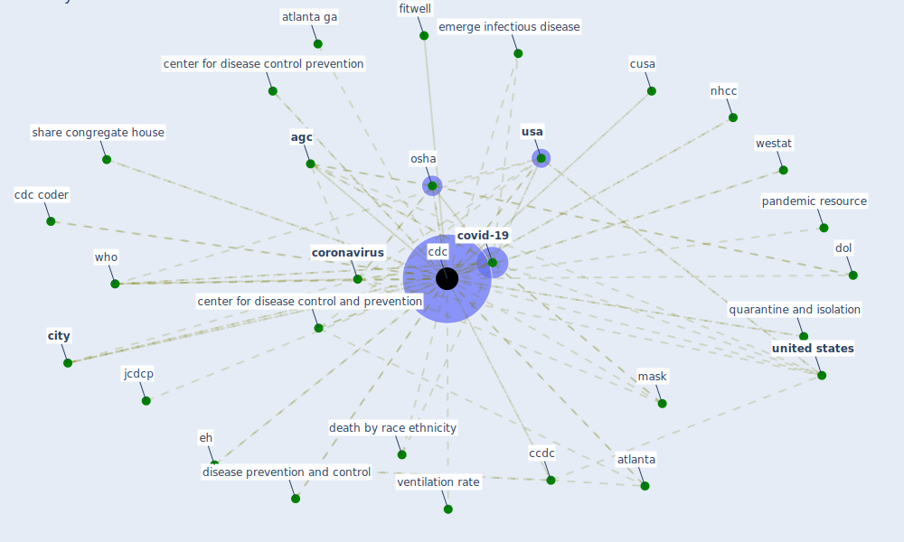

# Keyword: cdc

## Keywords

 * administrative control, [agc](keyword_agc), [aiir](keyword_aiir), [ashrae](keyword_ashrae), atlanta, atlanta ga, case in we, ccdc, [cdc](keyword_cdc), cdc coder, cdc covid 19, center for disease and control, center for disease control and prevention, center for disease control and prevention usa, center for disease control prevention, center for diseasecontrol and prevention, [china](keyword_china), [city](keyword_city), community mitigation guideline, cool center, [coronavirus](keyword_coronavirus), covid 19 19, covid 19 management, [covid-19](keyword_covid-19), cusa, death by race ethnicity, disease control and prevention, disease prevention and control, [disinfection](keyword_disinfection), dol, effect of the coronavirus covid 19 pandemic, eh, emerge infectious disease, emergency, emergency preparedness and response, era5, fair health, fitwell, gondwana re, gondwana re 93, guideline for prevent the transmission of mycobacterium tuberculosis in health care facility, health _ statistic, health and safety agency, infectioncontrol, jcdcp, lippman d, long termcare, [mask](keyword_mask), missouri cancer registry, mitigation guideline, [monitor](keyword_monitor), mwr, [nhcc](keyword_nhcc), [nih](keyword_nih), niosh, onavirus, [osha](keyword_osha), [pandemic](keyword_pandemic), pandemic resource, plast, plast reconstr surg, [policy](keyword_policy), preparedness, prevent get sick, [primer](keyword_primer), [public health](keyword_public_health), quarantine and isolation, resume business toolkit, safety and health agency, share congregate house, [taiwan](keyword_taiwan), [tuberculosis](keyword_tuberculosis), [united states](keyword_united_states), [usa](keyword_usa), ventilation rate, ventilation rate requirement, westat, who, [world health organization](keyword_world_health_organization)

## Mapping

## Neighbours

### Closest articles

* Analysis of COVID-19 Concerns Raised by the Construction Workforce and Development of Mitigation Practices - [LINK](article_bou_hatoum_analysis_2021)
* A Comprehensive Review of the COVID-19 Pandemic and the Role of IoT, Drones, AI, Blockchain, and 5G in Managing its Impact - [LINK](article_chamola_comprehensive_2020)
* COVID-19 misinformation: Accuracy of articles about coronavirus prevention mostly shared on social media - [LINK](article_obiala_covid-19_2021)
* Mitigation strategies and compliance in the COVID-19 fight; how much compliance is enough? - [LINK](article_mukerjee_mitigation_2021)
* Association of built environment attributes with the spread of COVID-19 at its initial stage in China - [LINK](article_li_association_2021)
* Digital Twin of COVID-19 Mass Vaccination Centers - [LINK](article_pilati_digital_2021)
* Effects of temperature and humidity on the spread of COVID-19: A systematic review - [LINK](article_mecenas_effects_2020)
* Green in times of COVID-19: urban green space relevance during the COVID-19 pandemic in Buenos Aires City - [LINK](article_marconi_green_2022)
* Design COVID-19 Ontology: A Healthcare and Safety Perspective - [LINK](article_aloulou_design_2022)
* How the 5G Enabled the COVID-19 Pandemic Prevention and Control: Materiality, Affordance, and (De-)Spatialization - [LINK](article_li_how_2022)

### Closest BPs

