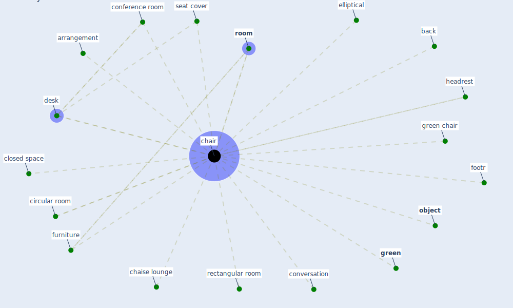

# Keyword: chair

## Keywords

 * arrangement, back, [chair](keyword_chair), chairs, chaise lounge, circular room, closed space, conference room, conversation, [desk](keyword_desk), elliptical, footr, furniture, [green](keyword_green), green chair, headrest, [object](keyword_object), rectangular room, [room](keyword_room), seat cover

## Mapping

## Neighbours

### Closest articles

* Social distancing enhanced automated optimal design of physical spaces in the wake of the COVID-19 pandemic - [LINK](article_ugail_social_2021)
* Methods for air cleaning and protection of building occupants from airborne pathogens - [LINK](article_bolashikov_methods_2009)
* COVID-19 Could Leverage a Sustainable Built Environment - [LINK](article_pinheiro_covid-19_2020)
* How the Coronavirus Will Reshape Architecture - [LINK](article_chayka_how_2020)
* Health, Wellbeing \& Productivity in Offices - [LINK](article_world_green_building_council_health_2014)
* Assessment of COVID-19 precautionary measures in sports facilities: A case study on a health club in Saudi Arabia - [LINK](article_ibrahim_assessment_2022)

### Closest BPs

