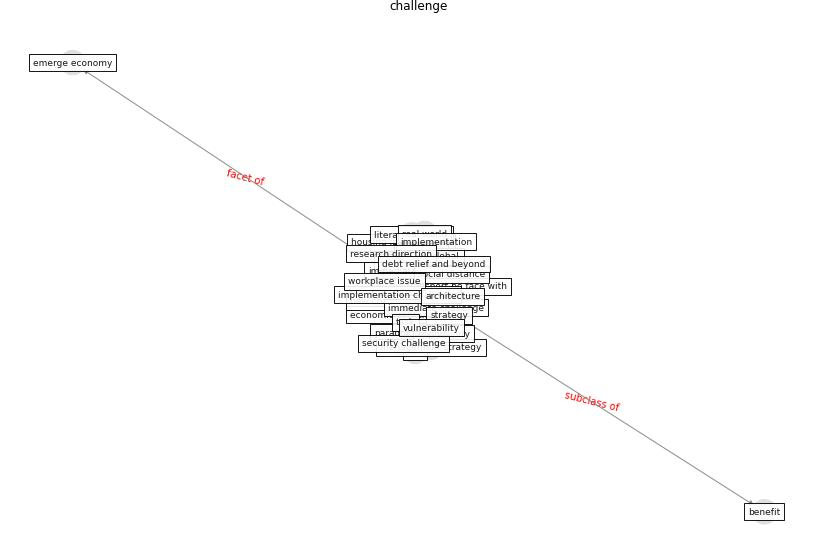

# Keyword: __challenge__
## Clusters

* Cluster 4: [smart-city](cluster_4)

## Concepts

 

## Top 10 articles for __challenge__
* Leveraging Digital Transformation Technologies to
Tackle COVID-19: Proposing a Privacy-First
Holistic Framework ([arpaci_leveraging_2021](article_arpaci_leveraging_2021))
* Exploring the Non-Medical impacts of Covid-19 using
Natural Language Processing ([agade_exploring_2020](article_agade_exploring_2020))
* Respiratory pandemics, urban planning and design: A
multidisciplinary rapid review of the literature ([harris_respiratory_2022](article_harris_respiratory_2022))
* eurofund_sustainable_2016 ([eurofund_sustainable_2016](article_eurofund_sustainable_2016))
* Ten questions concerning occupant health in buildings
during normal operations and extreme events including the
COVID-19 pandemic ([awada_ten_2021](article_awada_ten_2021))
* world_bank_world_2022 ([world_bank_world_2022](article_world_bank_world_2022))
* COVID19: Small and medium enterprises challenges and
responses with creativity, innovation, and
entrepreneurship ([thukral_covid19_2021](article_thukral_covid19_2021))
* The role of 5G for digital healthcare against COVID-19
pandemic: Opportunities and challenges ([siriwardhana_role_2021](article_siriwardhana_role_2021))
* Coronavirus questions that will not go away: interrogating
urban and socio-spatial implications of COVID-19
measures ([salama_coronavirus_2020](article_salama_coronavirus_2020))
* realdania_refleksioner_2022_EN ([realdania_refleksioner_2022_EN](article_realdania_refleksioner_2022_EN))
