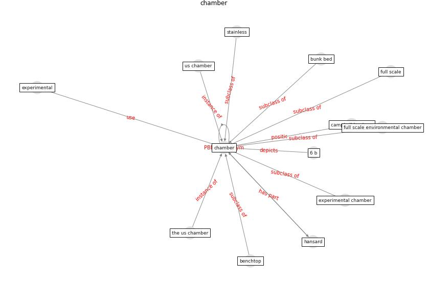

# Keyword: chamber

* [uvc-hcov](cluster_Cluster_7)

## Keywords

 * 6 b, Cluster_7, benchtop, campbell lendrum, [chamber](keyword_chamber), chambers, full scale, full scale environmental chamber, stainless, the us chamber, us chamber

## Concepts

 

## Neighbours

### Closest articles

* Characterization and performance evaluation of a full-scale activated carbon-based dynamic botanical air filtration system for improving indoor air quality - [LINK](article_wang_characterization_2011)
* A critical analysis of the impacts of COVID-19 on the global economy and ecosystems and opportunities for circular economy strategies - [LINK](article_ibn-mohammed_critical_2021)
* Revisiting the built environment: 10 potential development changes and paradigm shifts due to COVID-19 - [LINK](article_cheshmehzangi_revisiting_2021)
* Far-UVC light (222 nm) efficiently and safely inactivates airborne human coronaviruses - [LINK](article_buonanno_far-uvc_2020)

### Closest BPs

