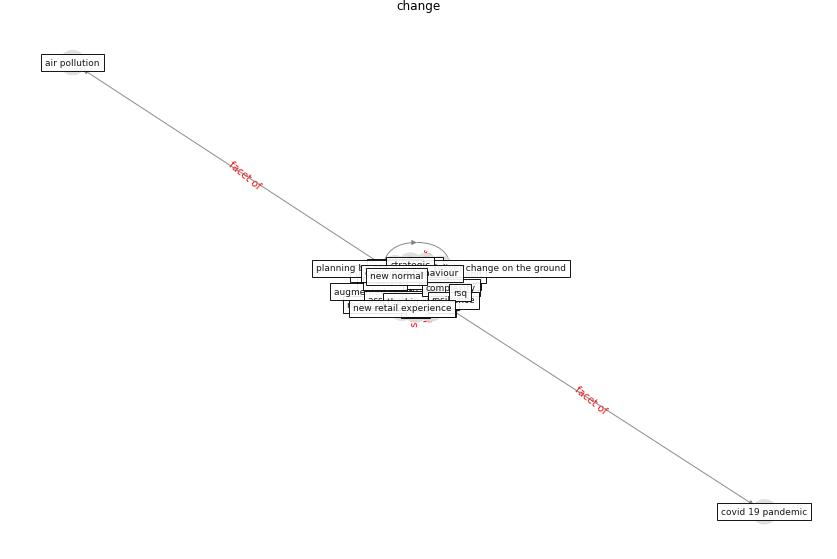

# Keyword: __change__
## Clusters

* Cluster 9: [climate-change](cluster_9)

## Concepts

 

## Top 10 articles for __change__
* Navigating Climate Change: Rethinking the Role of
Buildings ([cole_navigating_2020](article_cole_navigating_2020))
* COVID19: Small and medium enterprises challenges and
responses with creativity, innovation, and
entrepreneurship ([thukral_covid19_2021](article_thukral_covid19_2021))
* COVID-19 Experience Transforming the Protective
Environment of Office Buildings and Spaces ([phapant_covid-19_2021](article_phapant_covid-19_2021))
* realdania_refleksioner_2022_EN ([realdania_refleksioner_2022_EN](article_realdania_refleksioner_2022_EN))
* oecd_guidelines_2014 ([oecd_guidelines_2014](article_oecd_guidelines_2014))
* Learning from pandemics: Applying resilience thinking to
identify priorities for planning urban settlements ([syal_learning_2021](article_syal_learning_2021))
* Global value chains: Efficiency and risks in the context
of COVID-19 ([oecd_global_2021](article_oecd_global_2021))
* rtpi_urban_2021 ([rtpi_urban_2021](article_rtpi_urban_2021))
* who_strengthening_2017 ([who_strengthening_2017](article_who_strengthening_2017))
* Occupant health in buildings: Impact of the COVID-19
pandemic on the opinions of building professionals and
implications on research ([awada_occupant_2022](article_awada_occupant_2022))
