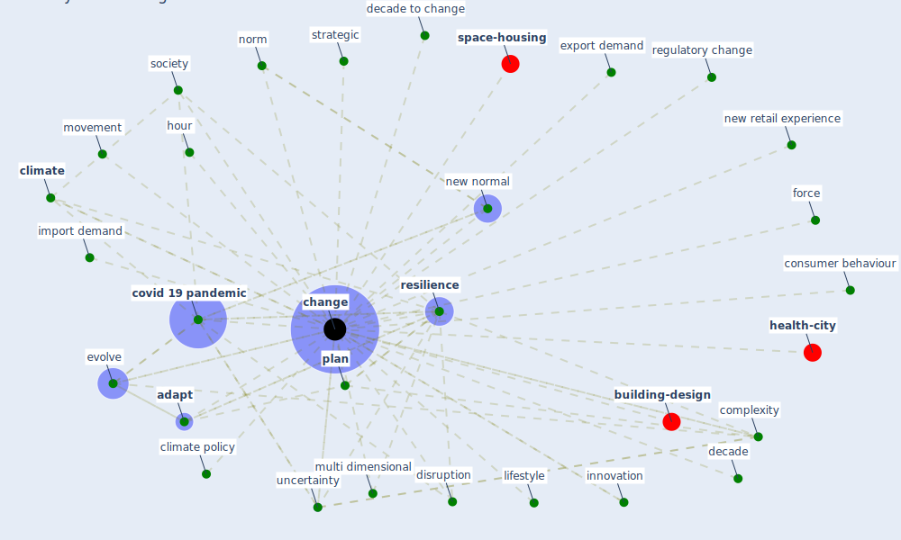

# Keyword: change

* [construction-pandemic](cluster_1)

* [building-energy](cluster_2)

* [malaria-vector](cluster_7)

* [resilience-infrastructure](cluster_11)

* [water-wastewater](cluster_13)

## Keywords

 * Cluster_1, Cluster_11, Cluster_13, Cluster_2, Cluster_7, adapt, [air pollution](keyword_air_pollution), anthropogenic, [anxiety](keyword_anxiety), augmented reality, [change](keyword_change), changes, changing, [climate](keyword_climate), climate be always change, [climate change](keyword_climate_change), climate policy, complexity, consumer behaviour, [covid 19 pandemic](keyword_covid_19_pandemic), decade, decade to change, disruption, evolve, export demand, force, hour, import demand, [innovation](keyword_innovation), lifestyle, movement, multi dimensional, new normal, new retail experience, norm, [plan](keyword_plan), regulatory change, [resilience](keyword_resilience), [society](keyword_society), strategic, uncertainty, weather

## Mapping

## Neighbours

### Closest articles

* How COVID-19 Could Accelerate the Adoption of New Retail Technologies and Enhance the (E-)Servicescape - [LINK](article_willems_how_2021)
* Navigating Climate Change: Rethinking the Role of Buildings - [LINK](article_cole_navigating_2020)
* <scp>COVID</scp>             ‐19: Small and medium enterprises challenges and responses with creativity, innovation, and entrepreneurship - [LINK](article_thukral_covid19_2021)
* COVID-19 Experience Transforming the Protective Environment of Office Buildings and Spaces - [LINK](article_phapant_covid-19_2021)
* Learning from pandemics: Applying resilience thinking to identify priorities for planning urban settlements - [LINK](article_syal_learning_2021)
* Covid-19 and the politics of sustainable energy transitions - [LINK](article_kuzemko_covid-19_2020)
* Guidelines for resilience systems analysis - [LINK](article_oecd_guidelines_2014)
* Occupant health in buildings: Impact of the COVID-19 pandemic on the opinions of building professionals and implications on research - [LINK](article_awada_occupant_2022)
* World Bank Development Report - [LINK](article_world_bank_world_2022)

### Closest BPs

