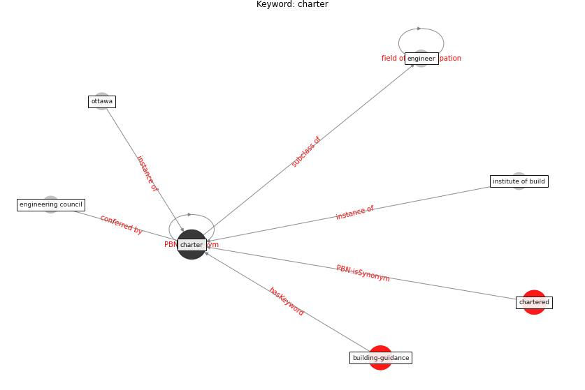

# Keyword: charter

* [building-guidance](cluster_Cluster_15)

## Keywords

 * Cluster_15, [charter](keyword_charter), chartered, engineer, engineering council, institute of build, ottawa

## Concepts

 

## Neighbours

### Closest articles

* Emerging from Lockdown: CIBSE COVID-19 Guidance - [LINK](article_cibse_emerging_2020)
* Guidelines for Responding to COVID-19 Pandemic: Best Practices, Impacts, and Future Research Directions - [LINK](article_assaad_guidelines_2021)
* Strengthening resilience: a priority shared by Health 2020 and - [LINK](article_who_strengthening_2017)

### Closest BPs

