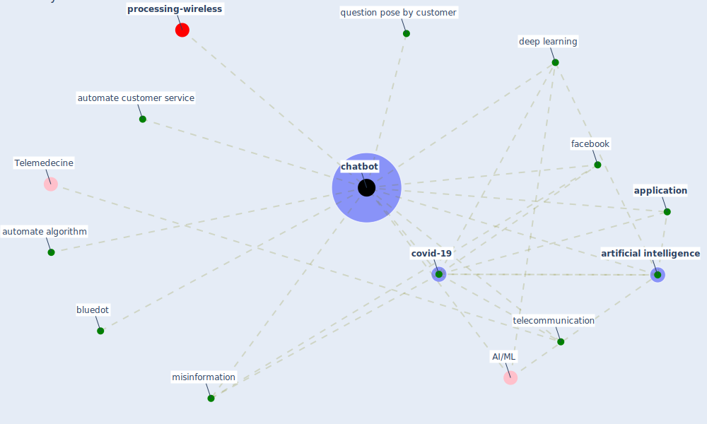

# Keyword: chatbot

* [processing-wireless](cluster_14)

## Keywords

 * AI/ML, Cluster_14, [application](keyword_application), [artificial intelligence](keyword_artificial_intelligence), automate algorithm, automate customer service, bluedot, [chatbot](keyword_chatbot), chatbots, [covid-19](keyword_covid-19), [deep learning](keyword_deep_learning), [facebook](keyword_facebook), [misinformation](keyword_misinformation), question pose by customer, telecommunication

## Mapping

## Neighbours

### Closest articles

* How COVID-19 Could Accelerate the Adoption of New Retail Technologies and Enhance the (E-)Servicescape - [LINK](article_willems_how_2021)
* Mobile Technology Solution for COVID-19: Surveillance and Prevention - [LINK](article_raza_mobile_2021)
* Telehealth overpromises during the Covid-19 pandemic - [LINK](article_ostherr_telehealth_2020)
* Contributions of Smart City Solutions and Technologies to Resilience against the COVID-19 Pandemic: A Literature Review - [LINK](article_sharifi_contributions_2021)

### Closest BPs

