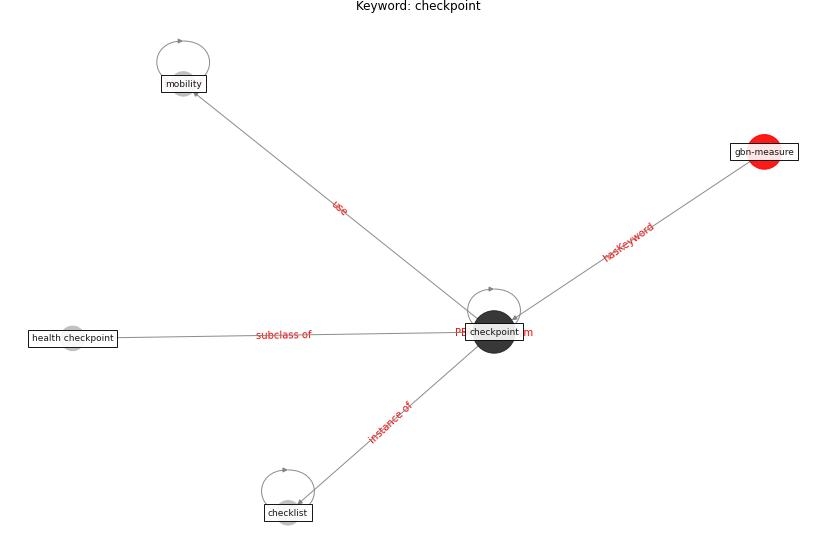

# Keyword: checkpoint

* [gbn-measure](cluster_Cluster_10)

## Keywords

 * Cluster_10, checklist, [checkpoint](keyword_checkpoint), health checkpoint, [mobility](keyword_mobility)

## Concepts

 

## Neighbours

### Closest articles

* 10 Adaptive Measures for Public Places to face the COVID 19 Pandemic Outbreak - [LINK](article_cheshmehzangi_10_2020)
* Validity of energy social research during and after COVID-19: challenges, considerations, and responses - [LINK](article_fell_validity_2020)
* The Impact of COVID-19 on Public Space: A Review of the Emerging Questions - [LINK](article_honey-roses_impact_2020)

### Closest BPs

