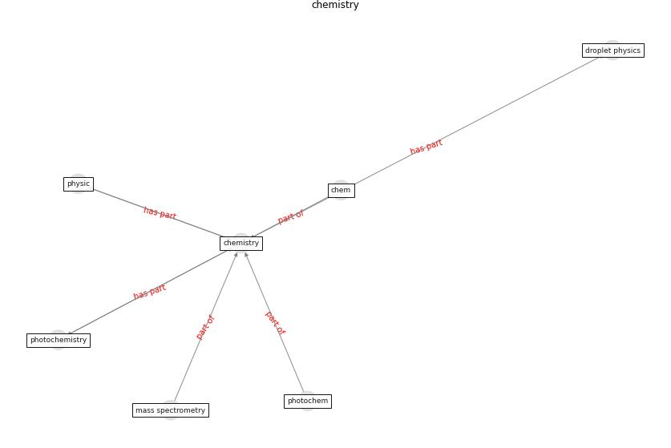

# Keyword: __chemistry__

## Concepts

 

## Top articles for __chemistry__
* Mechanistic insights into the effect of humidity on
airborne influenza virus survival, transmission and
incidence ([marr_mechanistic_2019](article_marr_mechanistic_2019))
* Future perspectives of wastewater-based epidemiology:
Monitoring infectious disease spread and resistance to
the community level ([sims_future_2020](article_sims_future_2020))
