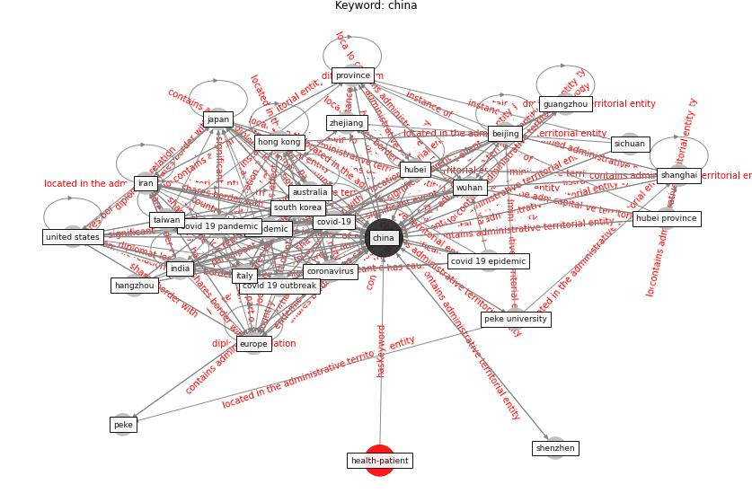

# Keyword: __china__
## Clusters

* Cluster 14: [surveying-drone](cluster_14.md)

## Concepts

 

## Articles
* A Comprehensive Review of the COVID-19 Pandemic
and the Role of IoT, Drones, AI, Blockchain, and
5G in Managing its Impact ([chamola_comprehensive_2020](article_chamola_comprehensive_2020.md))
* Role of Information Technology in Covid-19
Prevention ([mehtab_alam_role_2021](article_mehtab_alam_role_2021.md))
* Respiratory pandemics, urban planning and design: A
multidisciplinary rapid review of the literature ([harris_respiratory_2022](article_harris_respiratory_2022.md))
* Contributions of Smart City Solutions and
Technologies to Resilience against the COVID-19
Pandemic: A Literature Review ([sharifi_contributions_2021](article_sharifi_contributions_2021.md))
* Effects of temperature and humidity on the spread of
COVID-19: A systematic review ([mecenas_effects_2020](article_mecenas_effects_2020.md))
* Seeing the invisible hand: Underlying effects of
COVID-19 on tourists’ behavioral patterns ([li_seeing_2020](article_li_seeing_2020.md))
* Disinfection technology of hospital wastes and wastewater:
Suggestions for disinfection strategy during coronavirus
Disease 2019 (COVID-19) pandemic in China ([wang_disinfection_2020](article_wang_disinfection_2020.md))
* A Global Survey of Infection Control and
Mitigation Measures for Combating the Transmission
of COVID-19 Pandemic in Buildings Under
Facilities Management Services ([sarvari_global_2022](article_sarvari_global_2022.md))
* The impacts of knowledge, risk perception, emotion and
information on citizens’ protective behaviors during the
outbreak of COVID-19: a cross-sectional study in
China ([ning_impacts_2020](article_ning_impacts_2020.md))
* An Intelligent IEQ Monitoring and Feedback
System: Development and Applications ([geng_intelligent_2021](article_geng_intelligent_2021.md))
