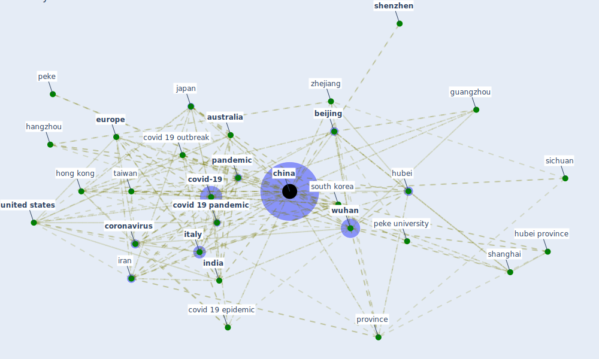

# Keyword: china

* [china-case](cluster_5)

## Keywords

 * [5 g network](keyword_5_g_network), [air pollution](keyword_air_pollution), [artificial intelligence](keyword_artificial_intelligence), asia, asian, asian country, asian market, [australia](keyword_australia), be attribute, [beijing](keyword_beijing), [building](keyword_building), carbon emission, [china](keyword_china), [chinese](keyword_chinese), chinese new year holiday, [city](keyword_city), [construction industry](keyword_construction_industry), [coronavirus](keyword_coronavirus), [coronavirus outbreak](keyword_coronavirus_outbreak), [country](keyword_country), covid 19 epidemic, covid 19 infection, covid 19 outbreak, covid 19 outbreak in china, [covid 19 pandemic](keyword_covid_19_pandemic), [covid-19](keyword_covid-19), dalian, [danish](keyword_danish), [economy](keyword_economy), emerge economy, emerge market, [europe](keyword_europe), [evidence](keyword_evidence), fao, guangzhou, guiyang, guo et guo, haikou, hainan, hangzhou, harbin, health commission, heihe tengchong line, henan, [hong kong](keyword_hong_kong), hong kong sar, hongkong, [hubei](keyword_hubei), hubei province, huoshenshan hospital, [india](keyword_india), indisingapore, iran, [italy](keyword_italy), [japan](keyword_japan), jinan, lunar new year, mainland, [manufacture](keyword_manufacture), megacitie, nanje, ningbo, oman, other part of the word, pacific asia, [pandemic](keyword_pandemic), peke, peke opera, peke university, [province](keyword_province), r p china, republic of korea, [shanghai](keyword_shanghai), shenzhen, sichuan, [sme](keyword_sme), [south africa](keyword_south_africa), [south korea](keyword_south_korea), state council, suzhou, [taiwan](keyword_taiwan), tsinghua university, [united kingdom](keyword_united_kingdom), [united states](keyword_united_states), [usa](keyword_usa), world, [world health organization](keyword_world_health_organization), [wuhan](keyword_wuhan), wuhan city, wuhan province, wuhan virus, xi an, yangtze, yinchuan, yunan province, zhang et zhang, zhangjiajie, zhejiang, zhejiang province, zhejiang university

## Mapping

## Neighbours

### Closest articles

* A Comprehensive Review of the COVID-19 Pandemic and the Role of IoT, Drones, AI, Blockchain, and 5G in Managing its Impact - [LINK](article_chamola_comprehensive_2020)
* World Bank Development Report - [LINK](article_world_bank_world_2022)
* The COVID-19 pandemic: Impacts on cities and major lessons for urban planning, design, and management - [LINK](article_sharifi_covid-19_2020)
* An investigation of transmission control measures during the first 50 days of the COVID-19 epidemic in China - [LINK](article_tian_investigation_2020)
* Association of built environment attributes with the spread of COVID-19 at its initial stage in China - [LINK](article_li_association_2021)
*  - [LINK](article_mehtab_alam_role_2021)
* Respiratory pandemics, urban planning and design: A multidisciplinary rapid review of the literature - [LINK](article_harris_respiratory_2022)
* The effect of human mobility and control measures on the COVID-19 epidemic in China - [LINK](article_kraemer_effect_2020)
* Toilets dominate environmental detection of SARS-CoV-2 virus in a hospital - [LINK](article_ding_toilets_2020)
* Urban Community Sustainable Development Patterns under the Influence of COVID-19: A Case Study Based on the Non-Contact Interaction Perspective of Hangzhou City - [LINK](article_wang_urban_2021)

### Closest BPs

