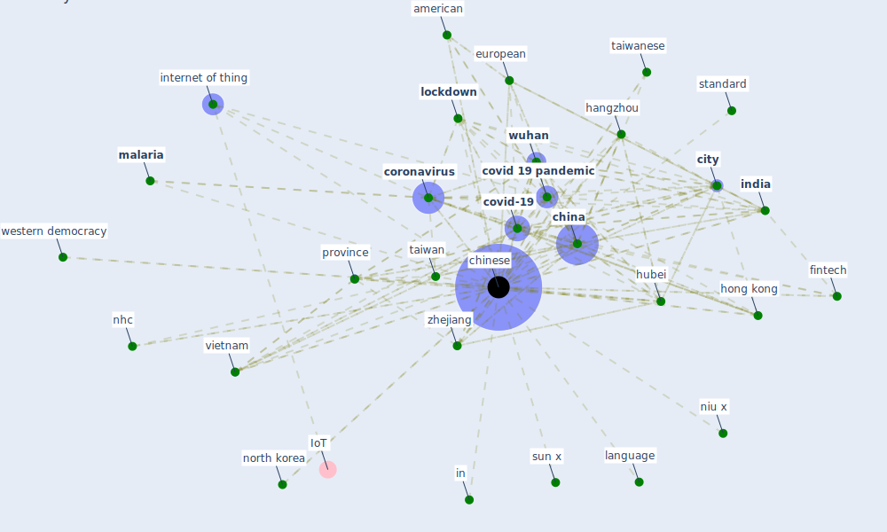

# Keyword: chinese

## Keywords

 * 2002 2003 sar pandemic, 368 city, academy of engineering and high education, academy of engineering and high education press limit company, air quality, alibaba, american, association of refrigeration, [australia](keyword_australia), automotive industry, [beijing](keyword_beijing), [building](keyword_building), centre for disease control and prevention, [china](keyword_china), [chinese](keyword_chinese), chinese association of refrigeration deoxyribonucleic acid, chinese economic activity, [city](keyword_city), [coronavirus](keyword_coronavirus), coronavirus infection, covid 19 epidemic, [covid 19 pandemic](keyword_covid_19_pandemic), [covid-19](keyword_covid-19), covid19 outbreak, [danish](keyword_danish), de j, dji, dxy, e commerce giant, english, ethnic minority, ethnic minority group, european, [experience](keyword_experience), experiment, exposure factor handbook of chinese population adult, extreme measure, fintech, [government](keyword_government), hangzhou, health safety, [hong kong](keyword_hong_kong), hot and humid region, hotel market, [hubei](keyword_hubei), in, [india](keyword_india), [internet of thing](keyword_internet_of_thing), japanese, kitchen, language, [lockdown](keyword_lockdown), low air quality, lunar new year, lunarnew year, [malaria](keyword_malaria), ministry of science and technology, municipality, mutianyu great wall, mybank, nhc, nhc gov cn, niu x, north korea, novel coronavirus, [outbreak](keyword_outbreak), p zhou, [pandemic](keyword_pandemic), population density, [province](keyword_province), province municipalitie, public generally, public generally have a high level of knowledge, publicly accessible datum, qi g, rong s, sar pandemic, shuang huang lian, south asian, south asian city, spring festival, [standard](keyword_standard), stock market, sun x, sunay, sunay healthcare supply, [taiwan](keyword_taiwan), taiwanese, tencent, tencent street view, topnew, tungusic, vietnam, wang h, western democracy, who, worldwide, [wuhan](keyword_wuhan), zhejiang, zhejiang university

## Mapping

## Neighbours

### Closest articles

* An Intelligent IEQ Monitoring and Feedback System: Development and Applications - [LINK](article_geng_intelligent_2021)
* Open-source analytics tools for studying the COVID-19 coronavirus outbreak - [LINK](article_wu_open-source_2020)
* The COVID-19 pandemic: Impacts on cities and major lessons for urban planning, design, and management - [LINK](article_sharifi_covid-19_2020)
* Seeing the invisible hand: Underlying effects of COVID-19 on tourists’ behavioral patterns - [LINK](article_li_seeing_2020)
* Construction of a Linked Data Set of COVID-19 Knowledge Graphs: Development and Applications - [LINK](article_wang_construction_2022)
* World Bank Development Report - [LINK](article_world_bank_world_2022)
* The impacts of knowledge, risk perception, emotion and information on citizens’ protective behaviors during the outbreak of COVID-19: a cross-sectional study in China - [LINK](article_ning_impacts_2020)
* Association of built environment attributes with the spread of COVID-19 at its initial stage in China - [LINK](article_li_association_2021)
* COVID-19 Pandemic: Rethinking Strategies for Resilient Urban Design, Perceptions, and Planning - [LINK](article_afrin_covid-19_2021)
* How COVID-19 Could Accelerate the Adoption of New Retail Technologies and Enhance the (E-)Servicescape - [LINK](article_willems_how_2021)

### Closest BPs

