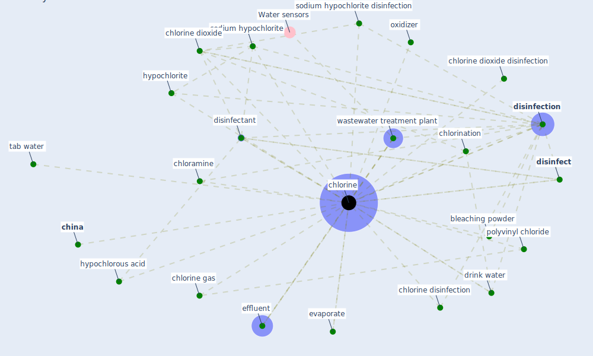

# Keyword: chlorine

## Keywords

 * bleaching powder, [china](keyword_china), chloramine, chlorination, [chlorine](keyword_chlorine), [chlorine dioxide](keyword_chlorine_dioxide), chlorine dioxide disinfection, chlorine disinfection, chlorine gas, [disinfect](keyword_disinfect), [disinfectant](keyword_disinfectant), [disinfection](keyword_disinfection), drink water, effluent, evaporate, hypochlorite, hypochlorous acid, oxidizer, polyvinyl chloride, sodium hypochlorite, sodium hypochlorite disinfection, tab water, wastewater treatment plant

## Mapping

## Neighbours

### Closest articles

* Disinfection technology of hospital wastes and wastewater: Suggestions for disinfection strategy during coronavirus Disease 2019 (COVID-19) pandemic in China - [LINK](article_wang_disinfection_2020)
* Assessment of COVID-19 precautionary measures in sports facilities: A case study on a health club in Saudi Arabia - [LINK](article_ibrahim_assessment_2022)
* Sustainability of Coronavirus on Different Surfaces - [LINK](article_suman_sustainability_2020)
* An environmental and health perspective for COVID-19 outbreak: Meteorology and air quality influence, sewage epidemiology indicator, hospitals disinfection, drug therapies and recommendations - [LINK](article_barcelo_environmental_2020)
* SARS-CoV-2 RNA detection of hospital isolation wards hygiene monitoring during the Coronavirus Disease 2019 outbreak in a Chinese hospital - [LINK](article_wang_sars-cov-2_2020)
* COVID-19 Pandemic: Prevention and Protection Measures to Be Adopted at the Workplace - [LINK](article_cirrincione_covid-19_2020)
* Prophylactic Architecture: Formulating the Concept of Pandemic-Resilient Homes - [LINK](article_elrayies_prophylactic_2022)
* Wastewater-Based Epidemiology to monitor COVID-19 outbreak: Present and future diagnostic methods to be in your radar - [LINK](article_barcelo_wastewater-based_2020)
* COVID-19 Could Leverage a Sustainable Built Environment - [LINK](article_pinheiro_covid-19_2020)
* Indirect effects of COVID-19 on the environment - [LINK](article_zambrano-monserrate_indirect_2020)

### Closest BPs

