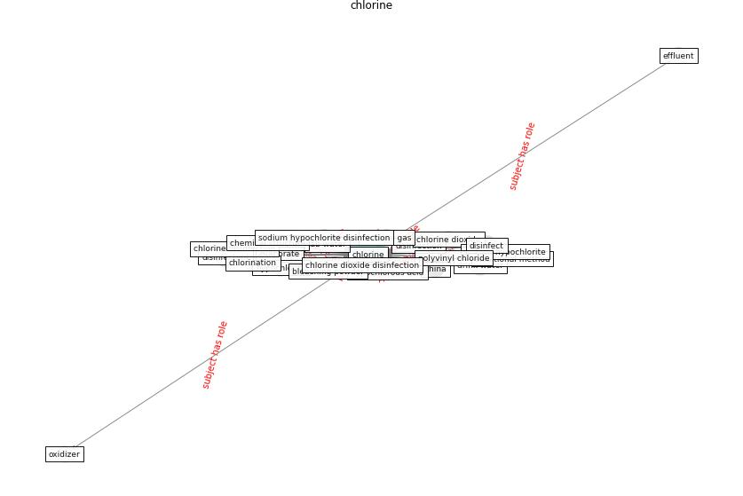

# Keyword: __chlorine__
## Clusters

* Cluster 15: [water-wastewater](cluster_15)

## Concepts

 

## Top 10 articles for __chlorine__
* Disinfection technology of hospital wastes and wastewater:
Suggestions for disinfection strategy during coronavirus
Disease 2019 (COVID-19) pandemic in China ([wang_disinfection_2020](article_wang_disinfection_2020))
* Assessment of COVID-19 precautionary measures in sports
facilities: A case study on a health club in Saudi
Arabia ([ibrahim_assessment_2022](article_ibrahim_assessment_2022))
* Sustainability of Coronavirus on Different
Surfaces ([suman_sustainability_2020](article_suman_sustainability_2020))
* SARS-CoV-2 RNA detection of hospital isolation wards
hygiene monitoring during the Coronavirus Disease 2019
outbreak in a Chinese hospital ([wang_sars-cov-2_2020](article_wang_sars-cov-2_2020))
* An environmental and health perspective for COVID-19
outbreak: Meteorology and air quality influence, sewage
epidemiology indicator, hospitals disinfection, drug
therapies and recommendations ([barcelo_environmental_2020](article_barcelo_environmental_2020))
* Prophylactic Architecture: Formulating the Concept
of Pandemic-Resilient Homes ([elrayies_prophylactic_2022](article_elrayies_prophylactic_2022))
* Wastewater-Based Epidemiology to monitor COVID-19
outbreak: Present and future diagnostic methods to be in
your radar ([barcelo_wastewater-based_2020](article_barcelo_wastewater-based_2020))
* COVID-19 Could Leverage a Sustainable Built
Environment ([pinheiro_covid-19_2020](article_pinheiro_covid-19_2020))
* Assessment method for new sustainability indicators
providing pandemic resilience for residential buildings ([tokazhanov_assessment_2021](article_tokazhanov_assessment_2021))
* A review of facilities management interventions to
mitigate respiratory infections in existing buildings ([zhang_review_2022](article_zhang_review_2022))
