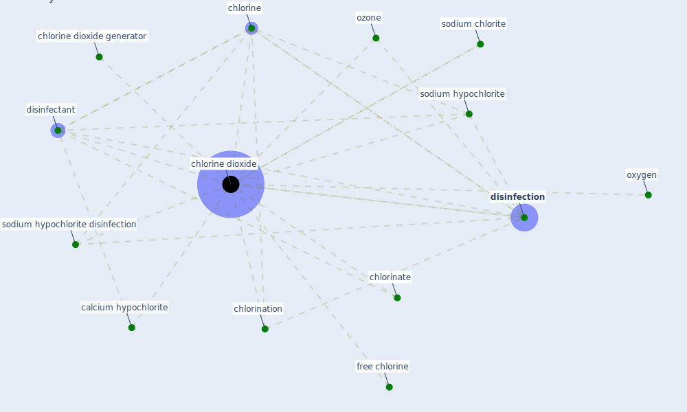

# Keyword: chlorine dioxide

## Keywords

 * calcium hypochlorite, chlorinate, chlorination, [chlorine](keyword_chlorine), [chlorine dioxide](keyword_chlorine_dioxide), chlorine dioxide generator, [disinfectant](keyword_disinfectant), [disinfection](keyword_disinfection), free chlorine, oxygen, ozone, sodium chlorite, sodium hypochlorite, sodium hypochlorite disinfection

## Mapping

## Neighbours

### Closest articles

* Disinfection technology of hospital wastes and wastewater: Suggestions for disinfection strategy during coronavirus Disease 2019 (COVID-19) pandemic in China - [LINK](article_wang_disinfection_2020)
* COVID-19 Could Leverage a Sustainable Built Environment - [LINK](article_pinheiro_covid-19_2020)

### Closest BPs

