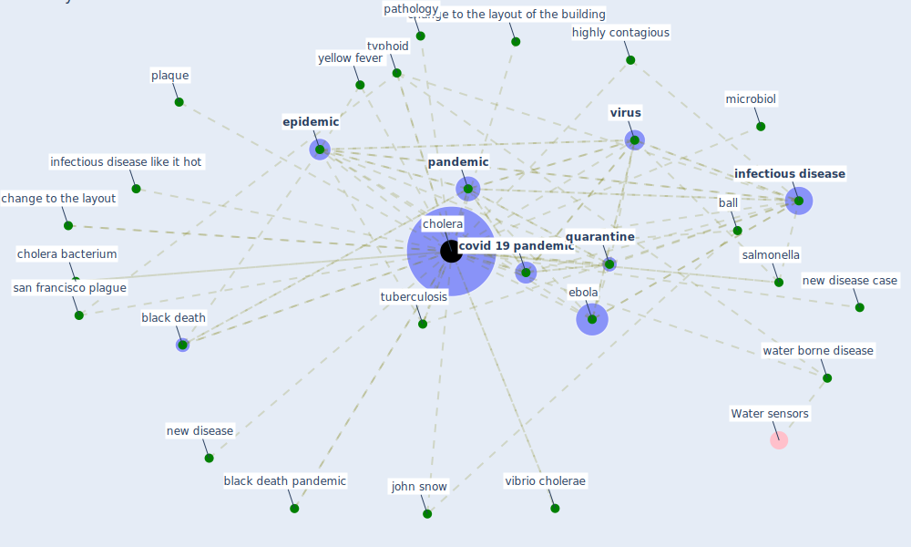

# Keyword: cholera

## Keywords

 * ball, black death, black death pandemic, change to the layout, change to the layout of the building, [cholera](keyword_cholera), cholera bacterium, [covid 19 pandemic](keyword_covid_19_pandemic), ebola, [epidemic](keyword_epidemic), highly contagious, [infectious disease](keyword_infectious_disease), infectious disease like it hot, john snow, [microbiol](keyword_microbiol), new disease, new disease case, [pandemic](keyword_pandemic), pathology, plaque, [quarantine](keyword_quarantine), salmonella, san francisco plague, [tuberculosis](keyword_tuberculosis), typhoid, vibrio cholerae, [virus](keyword_virus), water borne disease, yellow fever

## Mapping

## Neighbours

### Closest articles

* Houses amid COVID-19: Environmental challenges and design adaptation - [LINK](article_hizra_houses_2021)
* COVID-19 Could Leverage a Sustainable Built Environment - [LINK](article_pinheiro_covid-19_2020)
* Epidemics, Planning and the City: A Special Issue of Planning Perspectives - [LINK](article_davis_epidemics_2022)
* Coronavirus questions that will not go away: interrogating urban and socio-spatial implications of COVID-19 measures - [LINK](article_salama_coronavirus_2020)
* A Review on Building Design as a Biomedical System for Preventing COVID-19 Pandemic - [LINK](article_amran_review_2022)
* Prophylactic Architecture: Formulating the Concept of Pandemic-Resilient Homes - [LINK](article_elrayies_prophylactic_2022)
* How is COVID-19 Experience Transforming Sustainability Requirements of Residential Buildings? A Review - [LINK](article_tokazhanov_how_2020)
* Pandemic stricken cities on lockdown. Where are our planning and design professionals [now, then and into the future]? - [LINK](article_allam_pandemic_2020)
* Antivirus-built environment: Lessons learned from Covid-19 pandemic - [LINK](article_megahed_antivirus-built_2020)
* Guidelines for resilience systems analysis - [LINK](article_oecd_guidelines_2014)

### Closest BPs

