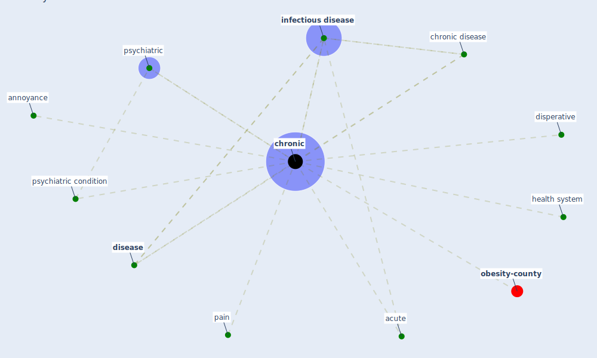

# Keyword: chronic

* [obesity-county](cluster_9)

## Keywords

 * Cluster_9, acute, [annoyance](keyword_annoyance), [chronic](keyword_chronic), [chronic disease](keyword_chronic_disease), [disease](keyword_disease), disperative, [health system](keyword_health_system), [infectious disease](keyword_infectious_disease), pain, psychiatric, psychiatric condition

## Mapping

## Neighbours

### Closest articles

* Treating two pandemics for the price of one: Chronic and infectious disease impacts of the built and natural environment - [LINK](article_frank_treating_2021)
* Mental health economics: A prospective study on psychological flourishing and associations with healthcare costs and sickness benefit transfers in Denmark - [LINK](article_santini_mental_2021)
* Green in times of COVID-19: urban green space relevance during the COVID-19 pandemic in Buenos Aires City - [LINK](article_marconi_green_2022)
* Psychological Effects of Home Confinement and Social Distancing Derived from COVID-19 in the General Population—A Systematic Review - [LINK](article_rodriguez-fernandez_psychological_2021)
* A critical analysis of the impacts of COVID-19 on the global economy and ecosystems and opportunities for circular economy strategies - [LINK](article_ibn-mohammed_critical_2021)
* Detection of SARS-CoV-2 in raw and treated wastewater in Germany – Suitability for COVID-19 surveillance and potential transmission risks - [LINK](article_westhaus_detection_2021)
* Strengthening resilience: a priority shared by Health 2020 and - [LINK](article_who_strengthening_2017)

### Closest BPs

