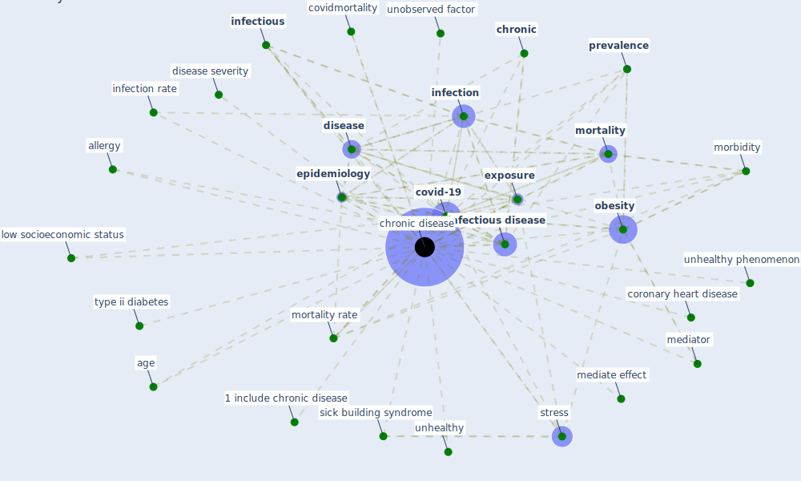

# Keyword: chronic disease

## Keywords

 * 1 include chronic disease, age, allergy, [chronic](keyword_chronic), [chronic disease](keyword_chronic_disease), chronic diseases, common, coronary heart disease, covid 19 infection, covid 19 mortality, covid 19 mortality rate, [covid-19](keyword_covid-19), covid19 mortality, covidmortality, [disease](keyword_disease), disease severity, [epidemiology](keyword_epidemiology), [exposure](keyword_exposure), [fatality](keyword_fatality), [hamidi](keyword_hamidi), [health care](keyword_health_care), health care delivery, [healthcare](keyword_healthcare), ill, [infection](keyword_infection), infection rate, [infectious](keyword_infectious), [infectious disease](keyword_infectious_disease), low socioeconomic status, mediate effect, mediator, morbidity, [mortality](keyword_mortality), mortality rate, [obesity](keyword_obesity), [prevalence](keyword_prevalence), sick building syndrome, [stress](keyword_stress), type ii diabetes, unhealthy, unhealthy phenomenon, unobserved factor, [usa](keyword_usa)

## Mapping

## Neighbours

### Closest articles

* Treating two pandemics for the price of one: Chronic and infectious disease impacts of the built and natural environment - [LINK](article_frank_treating_2021)
* How Architecture Fails in Conditions of Crisis: a Discussion on the Value of Interior Design over the COVID-19 Outbreak - [LINK](article_rassia_how_2020)
* The socio-economic determinants of COVID-19: A spatial analysis of German county level data - [LINK](article_ehlert_socio-economic_2021)
* Coronavirus questions that will not go away: interrogating urban and socio-spatial implications of COVID-19 measures - [LINK](article_salama_coronavirus_2020)
* Home garden use during COVID-19: Associations with physical and mental wellbeing in older adults - [LINK](article_corley_home_2021)
* Management of the COVID-19 pandemic: challenges, practices, and organizational support - [LINK](article_hossny_management_2022)
* How our homes impact our health: using a COVID-19 informed approach to examine urban apartment housing - [LINK](article_peters_how_2020)
* Mobile Technology Solution for COVID-19: Surveillance and Prevention - [LINK](article_raza_mobile_2021)
* Psychological Effects of Home Confinement and Social Distancing Derived from COVID-19 in the General Population—A Systematic Review - [LINK](article_rodriguez-fernandez_psychological_2021)
* Assessment of COVID-19 precautionary measures in sports facilities: A case study on a health club in Saudi Arabia - [LINK](article_ibrahim_assessment_2022)

### Closest BPs

