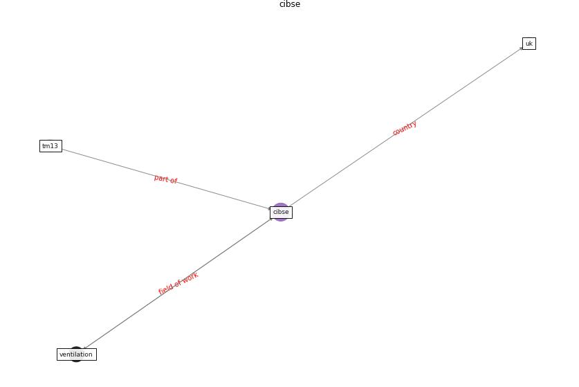

# Keyword: __cibse__
## Clusters

* Cluster 6: [building-guidance](cluster_6.md)

## Concepts

 

## Articles
* cibse_emerging_202 ([cibse_emerging_202](article_cibse_emerging_202.md))
* A Global Survey of Infection Control and
Mitigation Measures for Combating the Transmission
of COVID-19 Pandemic in Buildings Under
Facilities Management Services ([sarvari_global_2022](article_sarvari_global_2022.md))
* RUDDS_bioRxiv_update-0 ([RUDDS_bioRxiv_update-0](article_RUDDS_bioRxiv_update-0.md))
* realdania_refleksioner_2022_EN-1150 ([realdania_refleksioner_2022_EN-1150](article_realdania_refleksioner_2022_EN-1150.md))
* realdania_refleksioner_2022_EN-150 ([realdania_refleksioner_2022_EN-150](article_realdania_refleksioner_2022_EN-150.md))
* realdania_refleksioner_2022_EN-1450 ([realdania_refleksioner_2022_EN-1450](article_realdania_refleksioner_2022_EN-1450.md))
* realdania_refleksioner_2022_EN-1400 ([realdania_refleksioner_2022_EN-1400](article_realdania_refleksioner_2022_EN-1400.md))
* realdania_refleksioner_2022_EN-1350 ([realdania_refleksioner_2022_EN-1350](article_realdania_refleksioner_2022_EN-1350.md))
* realdania_refleksioner_2022_EN-1300 ([realdania_refleksioner_2022_EN-1300](article_realdania_refleksioner_2022_EN-1300.md))
* realdania_refleksioner_2022_EN-1250 ([realdania_refleksioner_2022_EN-1250](article_realdania_refleksioner_2022_EN-1250.md))
