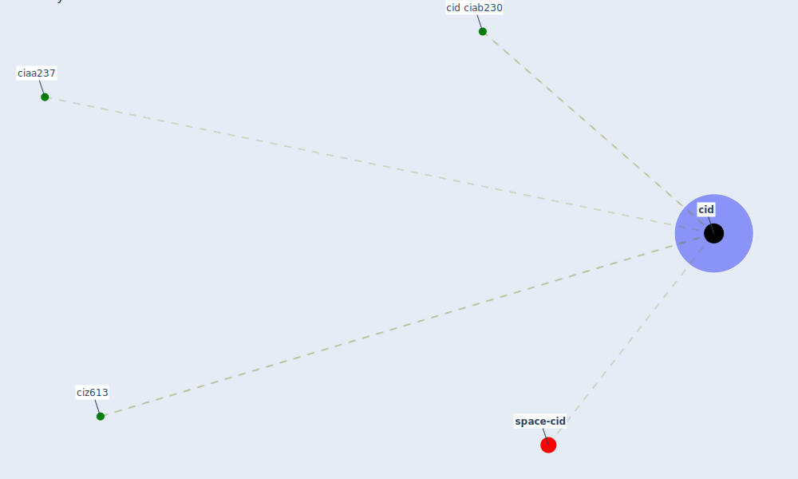

# Keyword: cid

* [space-cid](cluster_2)

## Keywords

 * Cluster_2, ciaa237, [cid](keyword_cid), cid ciab230, ciz613

## Mapping

## Neighbours

### Closest articles

* COVID-19 Experience Transforming the Protective Environment of Office Buildings and Spaces - [LINK](article_phapant_covid-19_2021)
* Nurture to nature via COVID-19, a self-regenerating environmental strategy of environment in global context - [LINK](article_paital_nurture_2020)
* Contributions to the mitigation of the COVID-19 pandemic - [LINK](article_pilz_contributions_2022)

### Closest BPs

