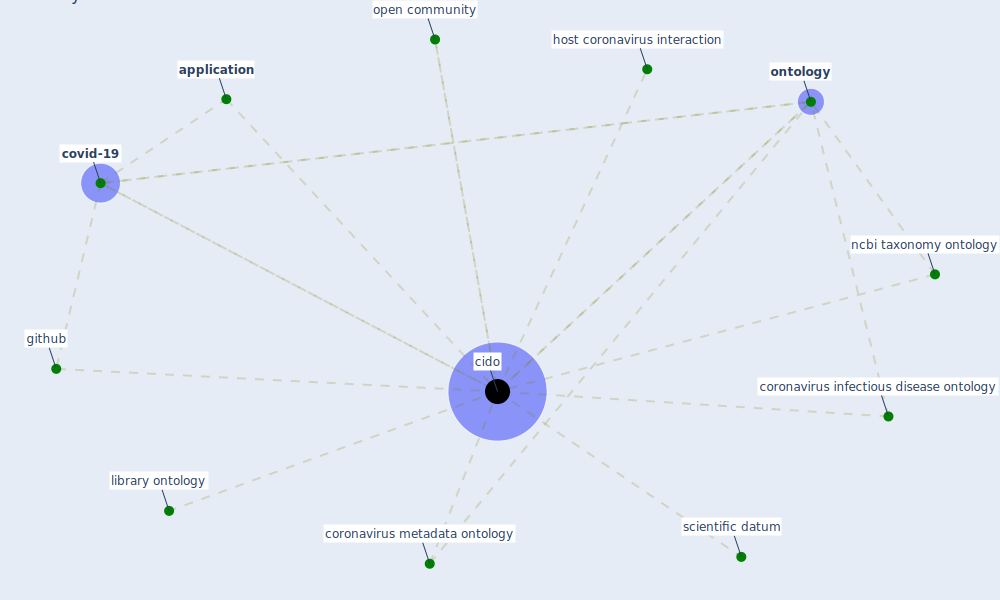

# Keyword: cido

## Keywords

 * [application](keyword_application), [cido](keyword_cido), coronavirus infectious disease ontology, coronavirus metadata ontology, [covid-19](keyword_covid-19), github, host coronavirus interaction, library ontology, ncbi taxonomy ontology, [ontology](keyword_ontology), open community, scientific datum

## Mapping

## Neighbours

### Closest articles

* CIDO, a community-based ontology for coronavirus disease knowledge and data integration, sharing, and analysis - [LINK](article_he_cido_2020)
* An Overview of Biomedical Ontologies for Pandemics and Infectious Diseases Representation - [LINK](article_bayoudhi_overview_2021)
* An Overview of Ontologies and Tool Support for COVID-19 Analytics - [LINK](article_ahmad_overview_2021)
* The COVID-19 epidemiology and monitoring ontology - [LINK](article_queralt-rosinach_covid-19_2021)

### Closest BPs

