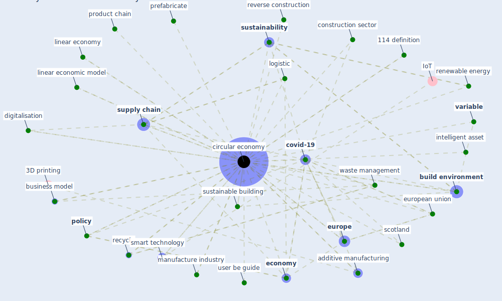

# Keyword: circular economy

## Keywords

 * 114 definition, a circular economy, a circular economy concept, additive manufacturing, aec industry, [build environment](keyword_build_environment), business model, ce 3 0, circular business model, circular economies, [circular economy](keyword_circular_economy), climate mitigation, close loop supply chain, concept, conceptualize the circular economy, [construction](keyword_construction), construction sector, [covid-19](keyword_covid-19), cradle to cradle hypothesis, [digitalisation](keyword_digitalisation), disaster, ecoin, ecoinnovation, [economy](keyword_economy), [europe](keyword_europe), europe eu circular economy action plan, [european union](keyword_european_union), greta effect, healthcare waste management, [india](keyword_india), intelligent asset, limit, limitation, linear economic model, linear economic system, linear economy, [logistic](keyword_logistic), low carbon industry, [manufacture](keyword_manufacture), manufacture industry, many variable, paradigm, [policy](keyword_policy), prefabricate, prefabricate building, product chain, [recycle](keyword_recycle), renewable energy, resource value, reverse construction, scotland, smart technology, [supply chain](keyword_supply_chain), [sustainability](keyword_sustainability), sustainability paradigm, sustainable building, the circular economy, typology, typology of circular economy, user be guide, [variable](keyword_variable), waste, waste management

## Mapping

## Neighbours

### Closest articles

* A critical analysis of the impacts of COVID-19 on the global economy and ecosystems and opportunities for circular economy strategies - [LINK](article_ibn-mohammed_critical_2021)
* Effects to Construction Project Management Impacted Circular Economic of Covid-19 Pandemic - [LINK](article_paikan_effects_2021)
* Propositions for a Resilient, Post-COVID-19 Future for the AEC Industry - [LINK](article_nassereddine_propositions_2021)
* Urban planning after COVID-19 - [LINK](article_rtpi_urban_2021)
* Future (post-COVID) digital, smart and sustainable cities in the wake of 6G: Digital twins, immersive realities and new urban economies - [LINK](article_allam_future_2021)
* Decision Making within the Built Environment as a Strategy for Mitigating the Risk of Malaria and Other Vector-Borne Diseases - [LINK](article_obonyo_decision_2018)
* COVID-19 Pandemic: Rethinking Strategies for Resilient Urban Design, Perceptions, and Planning - [LINK](article_afrin_covid-19_2021)
* COVID-19 and Green Housing: A Review of Relevant Literature - [LINK](article_kaklauskas_covid-19_2021)
* Mapping research in logistics and supply chain management during COVID-19 pandemic - [LINK](article_montoya-torres_mapping_2021)

### Closest BPs

