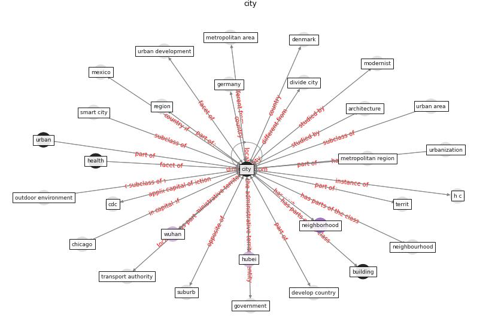

# Keyword: __city__
## Clusters

* Cluster 0: [health-city](cluster_0)

## Concepts

 

## Articles
* realdania_refleksioner_2022_EN ([realdania_refleksioner_2022_EN](article_realdania_refleksioner_2022_EN))
* Respiratory pandemics, urban planning and design: A
multidisciplinary rapid review of the literature ([harris_respiratory_2022](article_harris_respiratory_2022))
* Understanding the role of urban design in disease
spreading ([brizuela_understanding_2019](article_brizuela_understanding_2019))
* RUDDS_bioRxiv_update ([RUDDS_bioRxiv_update](article_RUDDS_bioRxiv_update))
* WHO-2019-nCoV-Urban_preparedness-2020 ([WHO-2019-nCoV-Urban_preparedness-2020](article_WHO-2019-nCoV-Urban_preparedness-2020))
* afrin_covid-19_2021 ([afrin_covid-19_2021](article_afrin_covid-19_2021))
* Coronavirus questions that will not go away: interrogating
urban and socio-spatial implications of COVID-19
measures ([salama_coronavirus_2020](article_salama_coronavirus_2020))
* Antivirus-built environment: Lessons learned from
Covid-19 pandemic ([megahed_antivirus-built_2020](article_megahed_antivirus-built_2020))
* COVID19-Routes: A Safe Pedestrian Navigation
Service ([cantarero_covid19-routes_2021](article_cantarero_covid19-routes_2021))
* Revisiting the built environment: 10 potential development
changes and paradigm shifts due to COVID-19 ([cheshmehzangi_revisiting_2021](article_cheshmehzangi_revisiting_2021))
