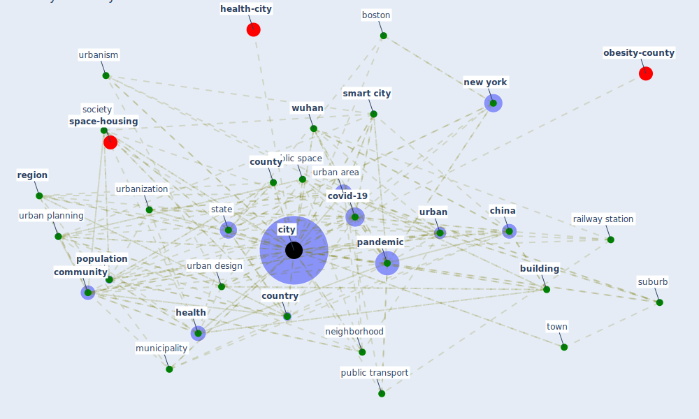

# Keyword: city

* [urban-city](cluster_5)

* [china-case](cluster_6)

## Keywords

 * activity center, african centre, amsterdam, [architecture](keyword_architecture), [boston](keyword_boston), [brazil](keyword_brazil), [bueno air](keyword_bueno_air), [build](keyword_build), [building](keyword_building), capital, [cdc](keyword_cdc), centre, chicago, [china](keyword_china), [chinese](keyword_chinese), citizen, [city](keyword_city), city for people, city level, city region, city size, citylab, civ civ, clamp down on car, [community](keyword_community), [country](keyword_country), county, [covid-19](keyword_covid-19), densely populate, [density](keyword_density), [design](keyword_design), destination, develop country, european, geography, [government](keyword_government), [health](keyword_health), [healthcare](keyword_healthcare), healthy city, high density, history, [housing](keyword_housing), housing policy, [hubei](keyword_hubei), inequality, [infection](keyword_infection), [infrastructure](keyword_infrastructure), inhabitant, [krako w](keyword_krako_w), large town, [london](keyword_london), metropolis, metropolitan region, mexico, [milan](keyword_milan), multi scalar understanding, municipality, national, [nature](keyword_nature), [neighborhood](keyword_neighborhood), neighbourhood, [new york](keyword_new_york), [new york city](keyword_new_york_city), official, [pandemic](keyword_pandemic), [pedestrian](keyword_pedestrian), [place](keyword_place), pollution, [population](keyword_population), population density, [province](keyword_province), [public place](keyword_public_place), [public space](keyword_public_space), [public transport](keyword_public_transport), public transportation, railway, [railway station](keyword_railway_station), rapid urbanization, region, [smart city](keyword_smart_city), [society](keyword_society), [state](keyword_state), street, suburb, [toronto](keyword_toronto), town, transport authority, [ug](keyword_ug), [urban](keyword_urban), urban area, urban design, urban fabric, urban infrastructure, [urban planning](keyword_urban_planning), urban society, urban study, [urbanism](keyword_urbanism), urbanization, [vienna](keyword_vienna), [wuhan](keyword_wuhan)

## Mapping

## Neighbours

### Closest articles

* Urban planning after COVID-19 - [LINK](article_rtpi_urban_2021)
* Association of built environment attributes with the spread of COVID-19 at its initial stage in China - [LINK](article_li_association_2021)
* Respiratory pandemics, urban planning and design: A multidisciplinary rapid review of the literature - [LINK](article_harris_respiratory_2022)
* The COVID-19 pandemic: Impacts on cities and major lessons for urban planning, design, and management - [LINK](article_sharifi_covid-19_2020)
* Understanding the role of urban design in disease spreading - [LINK](article_brizuela_understanding_2019)
* COVID-19 and Green Housing: A Review of Relevant Literature - [LINK](article_kaklauskas_covid-19_2021)
* The Impact of COVID-19 on Public Space: A Review of the Emerging Questions - [LINK](article_honey-roses_impact_2020)
* Future (post-COVID) digital, smart and sustainable cities in the wake of 6G: Digital twins, immersive realities and new urban economies - [LINK](article_allam_future_2021)
* COVID-19 Pandemic: Rethinking Strategies for Resilient Urban Design, Perceptions, and Planning - [LINK](article_afrin_covid-19_2021)
* Antivirus-built environment: Lessons learned from Covid-19 pandemic - [LINK](article_megahed_antivirus-built_2020)

### Closest BPs

