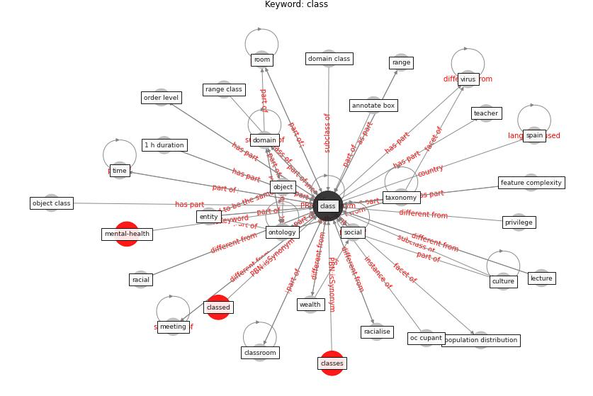

# Keyword: class

* [mental-health](cluster_Cluster_11)

## Keywords

 * 1 h duration, Cluster_11, annotate box, [bound box](keyword_bound_box), [class](keyword_class), class time, classed, classes, classroom, [culture](keyword_culture), [dataset](keyword_dataset), [domain](keyword_domain), domain class, dynamic envelope score, entity, event, extracurricular, extracurricular class, feature complexity, file, geographic, [human](keyword_human), income, inequality, inequity, interval, lawsuit, lecture, leisure time, meeting, object, object class, [object detection](keyword_object_detection), oc cupant, [occupant](keyword_occupant), [ontology](keyword_ontology), order level, [population](keyword_population), population distribution, privilege, racial, racialise, range, range class, reveal, [room](keyword_room), schedule, [social](keyword_social), [spain](keyword_spain), start time, subclass, sweden, taxonomy, teacher, time, [type](keyword_type), virtual learning, [virus](keyword_virus), virus in space, wealth, work hour

## Concepts

 

## Neighbours

### Closest articles

* The effect of occupant distribution on energy consumption and COVID-19 infection in buildings: A case study of university building - [LINK](article_mokhtari_effect_2021)
* DeepSOCIAL: Social Distancing Monitoring and Infection Risk Assessment in COVID-19 Pandemic - [LINK](article_rezaei_deepsocial_2020)
* COVID19-Routes: A Safe Pedestrian Navigation Service - [LINK](article_cantarero_covid19-routes_2021)
* Construction of a Linked Data Set of COVID-19 Knowledge Graphs: Development and Applications - [LINK](article_wang_construction_2022)
* Assessment of Building Automation and Control Systems in Danish Healthcare Facilities in the COVID-19 Era - [LINK](article_pedersen_assessment_2022)
* The Impact of COVID-19 on Public Space: A Review of the Emerging Questions - [LINK](article_honey-roses_impact_2020)
* An Overview of Biomedical Ontologies for Pandemics and Infectious Diseases Representation - [LINK](article_bayoudhi_overview_2021)
* The City Under COVID‐19: Podcasting As Digital Methodology - [LINK](article_rogers_city_2020)
* Contextualizing the Covid-19 pandemic for a carbon-constrained world: Insights for sustainability transitions, energy justice, and research methodology - [LINK](article_sovacool_contextualizing_2020)
* CIDO, a community-based ontology for coronavirus disease knowledge and data integration, sharing, and analysis - [LINK](article_he_cido_2020)

### Closest BPs

