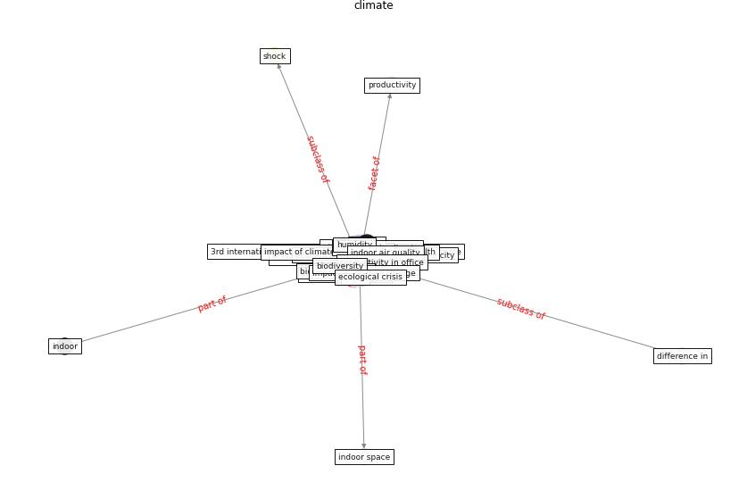

# Keyword: __climate__
## Clusters

* Cluster 12: [climate-change](cluster_12)

## Concepts

 

## Top 10 articles for __climate__
* rtpi_urban_2021 ([rtpi_urban_2021](article_rtpi_urban_2021))
* Effects of temperature and humidity on the spread of
COVID-19: A systematic review ([mecenas_effects_2020](article_mecenas_effects_2020))
* realdania_refleksioner_2022_EN ([realdania_refleksioner_2022_EN](article_realdania_refleksioner_2022_EN))
* The effect of a redesigned floor plan, occupant density
and the quality of indoor climate on the cost of space,
productivity and sick leave in an office building–A
case study ([saari_effect_2006](article_saari_effect_2006))
* Study of COVID-19 pandemic in London (UK) from urban
context ([ghosh_study_2020](article_ghosh_study_2020))
* Navigating Climate Change: Rethinking the Role of
Buildings ([cole_navigating_2020](article_cole_navigating_2020))
* Climate and the spread of COVID-19 ([chen_climate_2021](article_chen_climate_2021))
* harvard_th_chan_schoold_of_public_health_coronavirus_2020 ([harvard_th_chan_schoold_of_public_health_coronavirus_2020](article_harvard_th_chan_schoold_of_public_health_coronavirus_2020))
* Characterization and performance evaluation of a
full-scale activated carbon-based dynamic botanical air
filtration system for improving indoor air quality ([wang_characterization_2011](article_wang_characterization_2011))
* harvard_chan_community_coronavirus_2020 ([harvard_chan_community_coronavirus_2020](article_harvard_chan_community_coronavirus_2020))
