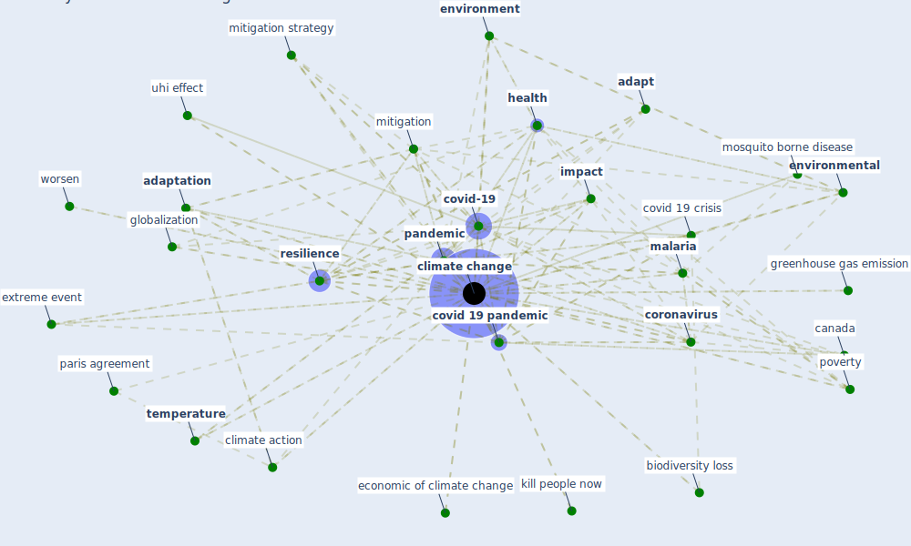

# Keyword: climate change

## Keywords

 * abyss, [adapt](keyword_adapt), [adaptation](keyword_adaptation), adaptation and mitigation efforts, anthropogenic biodiversity crisis, [biodiversity](keyword_biodiversity), biodiversity crisis, [biodiversity loss](keyword_biodiversity_loss), [canada](keyword_canada), carbon emission, climate action, [climate change](keyword_climate_change), climatic condition, controversial, cool but dangerous, [coronavirus](keyword_coronavirus), [covid 19 crisis](keyword_covid_19_crisis), [covid 19 pandemic](keyword_covid_19_pandemic), [covid-19](keyword_covid-19), [crisis](keyword_crisis), deforestation, disaster reduction and recovery, disease vectors, economic of climate change, emerge technology, [environment](keyword_environment), [environmental](keyword_environmental), escalating conditions, [europe](keyword_europe), extinction risk, extreme event, extreme weather event, [fix](keyword_fix), flooding, funding, future, ghg, ghg emission, globalization, globalwarming, government spending, greenhouse gas, greenhouse gas emission, [health](keyword_health), health official, [human health](keyword_human_health), [impact](keyword_impact), impacting human health, imperatively, increase food price, increase the energy demand of building, [infectious disease](keyword_infectious_disease), infectious disease spread, infectious disease spread as a result of climate change, interconnect world, kill people now, kyoto protocol, large crisis, link, loss and damage, main challenge, [malaria](keyword_malaria), mckinsey quarterly, mitigate, [mitigation](keyword_mitigation), mitigation strategy, more frequent and severe weather event, mosquito borne disease, neglect risk, [pandemic](keyword_pandemic), paris agreement, poverty, rapid urbanisation, [resilience](keyword_resilience), [rift valley fever](keyword_rift_valley_fever), risk assessment, sanitary crisis, scientist, sea level rise, socioeconomicissue, [solution](keyword_solution), [sustainability](keyword_sustainability), [sustainable](keyword_sustainable), sustainable approach, [sustainable architecture](keyword_sustainable_architecture), [sustainable development](keyword_sustainable_development), [sustainable development goal](keyword_sustainable_development_goal), sustainable energy policy, [temperature](keyword_temperature), threat, [transmission](keyword_transmission), transmission of coronavirus, uhi effect, urbanization, urgent action be require, [vaccine](keyword_vaccine), [vector borne disease](keyword_vector_borne_disease), why, why be it so important for health official to talk about climate change now, worsen

## Mapping

## Neighbours

### Closest articles

* COVID-19 risks and systemic gaps in Nigeria: resilience building lessons for pandemic and climate change management - [LINK](article_lawal_covid-19_2022)
* Navigating Climate Change: Rethinking the Role of Buildings - [LINK](article_cole_navigating_2020)
* Coronavirus and Climate Change - [LINK](article_harvard_th_chan_schoold_of_public_health_coronavirus_2020)
* What our response to the COVID-19 pandemic tells us of our capacity to respond to climate change - [LINK](article_gemenne_what_2020)
* Addressing vulnerability, building resilience: community-based adaptation to vector-borne diseases in the context of global change - [LINK](article_bardosh_addressing_2017)
* Urban planning after COVID-19 - [LINK](article_rtpi_urban_2021)
* Challenges to Mitigating the Urban Health Burden of Mosquito-Borne Diseases in the Face of Climate Change - [LINK](article_ligsay_challenges_2021)
* Urban Green Infrastructure and Green Open Spaces: An Issue of Social Fairness in Times of COVID-19 Crisis - [LINK](article_reinwald_urban_2021)
* The impact of climate change on the epidemiology and control of Rift Valley fever - PubMed - [LINK](article_martin_impact_2008)
* Biophilic design in architecture and its contributions to health, well-being, and sustainability: A critical review - [LINK](article_zhong_biophilic_2022)

### Closest BPs

