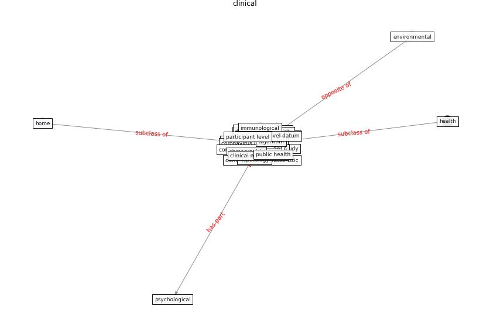

# Keyword: __clinical__
## Clusters

* Cluster 12: [wastewater-sars](cluster_12.md)

## Concepts

 

## Articles
* An Overview of Biomedical Ontologies for Pandemics
and Infectious Diseases Representation ([bayoudhi_overview_2021](article_bayoudhi_overview_2021.md))
* Challenges of data sharing in European Covid-19
projects: A learning opportunity for advancing pandemic
preparedness and response ([tacconelli_challenges_2022](article_tacconelli_challenges_2022.md))
* The socio-economic determinants of COVID-19: A spatial
analysis of German county level data ([ehlert_socio-economic_2021](article_ehlert_socio-economic_2021.md))
* Sustainability of Coronavirus on Different
Surfaces ([suman_sustainability_2020](article_suman_sustainability_2020.md))
* Computational analysis of SARS-CoV-2/COVID-19
surveillance by wastewater-based epidemiology locally and
globally: Feasibility, economy, opportunities and
challenges ([hart_computational_2020](article_hart_computational_2020.md))
* A Comprehensive Review of the COVID-19 Pandemic
and the Role of IoT, Drones, AI, Blockchain, and
5G in Managing its Impact ([chamola_comprehensive_2020](article_chamola_comprehensive_2020.md))
* Emerging Technologies to Combat the COVID-19
Pandemic ([vaishya_emerging_2020](article_vaishya_emerging_2020.md))
* First detection of SARS-CoV-2 in untreated wastewaters
in Italy ([la_rosa_first_2020](article_la_rosa_first_2020.md))
* SARS-CoV-2 in wastewater: potential health risk, but
also data source ([lodder_sars-cov-2_2020](article_lodder_sars-cov-2_2020.md))
* A Global Survey of Infection Control and
Mitigation Measures for Combating the Transmission
of COVID-19 Pandemic in Buildings Under
Facilities Management Services ([sarvari_global_2022](article_sarvari_global_2022.md))
