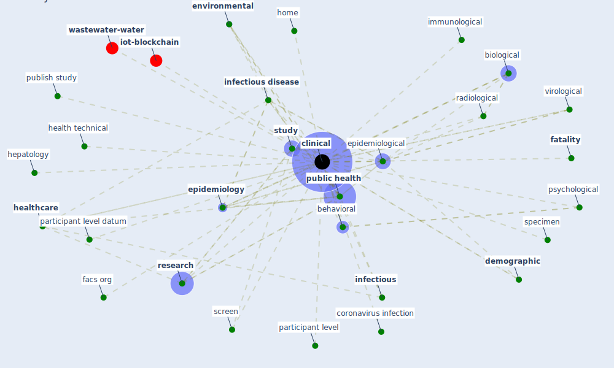

# Keyword: clinical

* [wastewater-water](cluster_0)

* [iot-blockchain](cluster_7)

## Keywords

 * Cluster_0, Cluster_7, administrative, [algorithm](keyword_algorithm), behavioral, biological, biology, [clinical](keyword_clinical), coronavirus infection, degree of uncertainty, [demographic](keyword_demographic), demographic characteristic, [diagnosis](keyword_diagnosis), diagnostic testing, [environmental](keyword_environmental), [epidemiological](keyword_epidemiological), [epidemiology](keyword_epidemiology), facs org, [fatality](keyword_fatality), [health](keyword_health), health technical, [healthcare](keyword_healthcare), [hepatology](keyword_hepatology), [home](keyword_home), immunological, [infectious](keyword_infectious), [infectious disease](keyword_infectious_disease), participant level, participant level datum, [psychological](keyword_psychological), [public health](keyword_public_health), publish study, radiological, [research](keyword_research), screen, specimen, [study](keyword_study), virological

## Mapping

## Neighbours

### Closest articles

* An Overview of Biomedical Ontologies for Pandemics and Infectious Diseases Representation - [LINK](article_bayoudhi_overview_2021)
* COVID-19: Risk assessment and mitigation measures in healthcare and non-healthcare workplaces - [LINK](article_fawzy_covid-19_2021)
* Sustainability of Coronavirus on Different Surfaces - [LINK](article_suman_sustainability_2020)
* SARS-CoV-2 RNA in wastewater anticipated COVID-19 occurrence in a low prevalence area - [LINK](article_randazzo_sars-cov-2_2020)
* Challenges of data sharing in European Covid-19 projects: A learning opportunity for advancing pandemic preparedness and response - [LINK](article_tacconelli_challenges_2022)
* First detection of SARS-CoV-2 in untreated wastewaters in Italy - [LINK](article_la_rosa_first_2020)
* The effect of human mobility and control measures on the COVID-19 epidemic in China - [LINK](article_kraemer_effect_2020)
* A Comprehensive Review of the COVID-19 Pandemic and the Role of IoT, Drones, AI, Blockchain, and 5G in Managing its Impact - [LINK](article_chamola_comprehensive_2020)
* Emerging Technologies to Combat the COVID-19 Pandemic - [LINK](article_vaishya_emerging_2020)
* Detection of SARS-CoV-2 in raw and treated wastewater in Germany – Suitability for COVID-19 surveillance and potential transmission risks - [LINK](article_westhaus_detection_2021)

### Closest BPs

