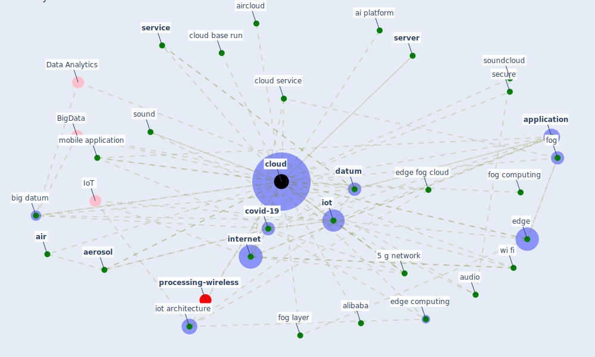

# Keyword: cloud

* [processing-wireless](cluster_14)

## Keywords

 * [5 g network](keyword_5_g_network), BigData, Cluster_14, account, [aerosol](keyword_aerosol), ai platform, [air](keyword_air), air quality analytic engine, aircloud, alibaba, analcloud, [application](keyword_application), audio, [big datum](keyword_big_datum), centralize, [cloud](keyword_cloud), cloud base run, cloud provider, cloud service, clouds, communication, compute, [covid-19](keyword_covid-19), [datum](keyword_datum), datum collection, datum storage, disperse, edge, edge computing, edge fog cloud, edge fog cloud paradigm, edge of the network, fog, fog computing, fog layer, google cloud, [ieq](keyword_ieq), [infrastructure](keyword_infrastructure), [internet](keyword_internet), [internet of thing](keyword_internet_of_thing), [iot](keyword_iot), iot architecture, management system, mobile application, ntp, secure, secure platform, [server](keyword_server), [service](keyword_service), small aerosol, [sound](keyword_sound), soundcloud, storage, [store](keyword_store), store service, [surveillance](keyword_surveillance), tag, tcp ip, totag, web service, [wi fi](keyword_wi_fi), wsn

## Mapping

## Neighbours

### Closest articles

* Scalable IoT Architecture for Monitoring IEQ Conditions in Public and Private Buildings - [LINK](article_calvo_scalable_2022)
* The ventilation of buildings and other mitigating measures for COVID-19: a focus on wintertime - [LINK](article_burridge_ventilation_2021)
* Pandemic Analytics: How Countries are Leveraging Big Data Analytics and Artificial Intelligence to Fight COVID-19? - [LINK](article_mehta_pandemic_2021)
* The City Under COVID‐19: Podcasting As Digital Methodology - [LINK](article_rogers_city_2020)
* How the 5G Enabled the COVID-19 Pandemic Prevention and Control: Materiality, Affordance, and (De-)Spatialization - [LINK](article_li_how_2022)
* Design COVID-19 Ontology: A Healthcare and Safety Perspective - [LINK](article_aloulou_design_2022)
* Impact of COVID-19 on IoT Adoption in Healthcare, Smart Homes, Smart Buildings, Smart Cities, Transportation and Industrial IoT - [LINK](article_umair_impact_2021)
* A comprehensive review on indoor air quality monitoring systems for enhanced public health - [LINK](article_saini_comprehensive_2020)
* An Intelligent IEQ Monitoring and Feedback System: Development and Applications - [LINK](article_geng_intelligent_2021)
* Propositions for a Resilient, Post-COVID-19 Future for the AEC Industry - [LINK](article_nassereddine_propositions_2021)

### Closest BPs

