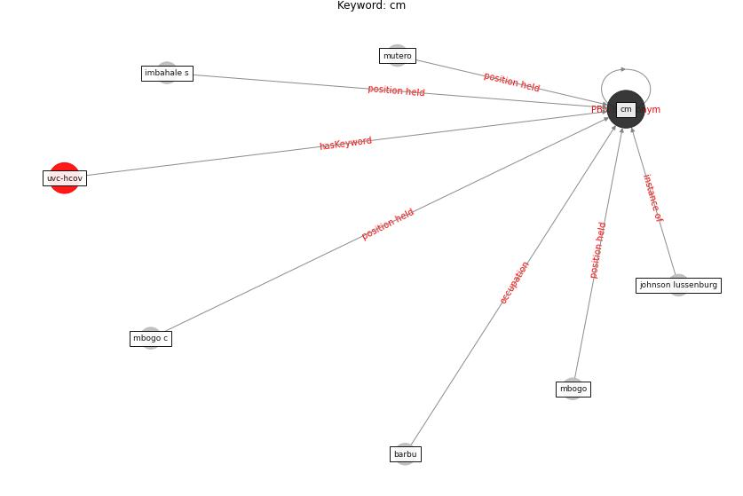

# Keyword: cm

* [uvc-hcov](cluster_Cluster_7)

## Keywords

 * Cluster_7, barbu, [cm](keyword_cm), imbahale s, johnson lussenburg, mbogo, mbogo c, mutero

## Concepts

 

## Neighbours

### Closest articles

* Addressing vulnerability, building resilience: community-based adaptation to vector-borne diseases in the context of global change - [LINK](article_bardosh_addressing_2017)
* Applications of ultraviolet germicidal irradiation disinfection in health care facilities: Effective adjunct, but not stand-alone technology - [LINK](article_memarzadeh_applications_2010)

### Closest BPs

