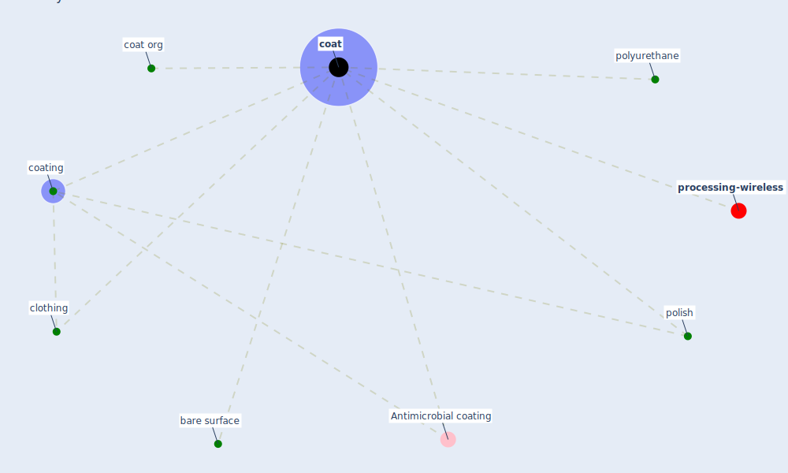

# Keyword: coat

* [processing-wireless](cluster_14)

## Keywords

 * Antimicrobial coating, Cluster_14, bare surface, clothing, [coat](keyword_coat), coat org, coated, [coating](keyword_coating), polish, [polyurethane](keyword_polyurethane)

## Mapping

## Neighbours

### Closest articles

* Graphene-based nanomaterials as antimicrobial surface coatings: A parallel approach to restrain the expansion of COVID-19 - [LINK](article_ayub_graphene-based_2021)
* A Surface Coating that Rapidly Inactivates SARS-CoV-2 - [LINK](article_behzadinasab_surface_2020)
* Sars-CoV-2 (COVID-19) inactivation capability of copper-coated touch surface fabricated by cold-spray technology - [LINK](article_hutasoit_sars-cov-2_2020)

### Closest BPs

