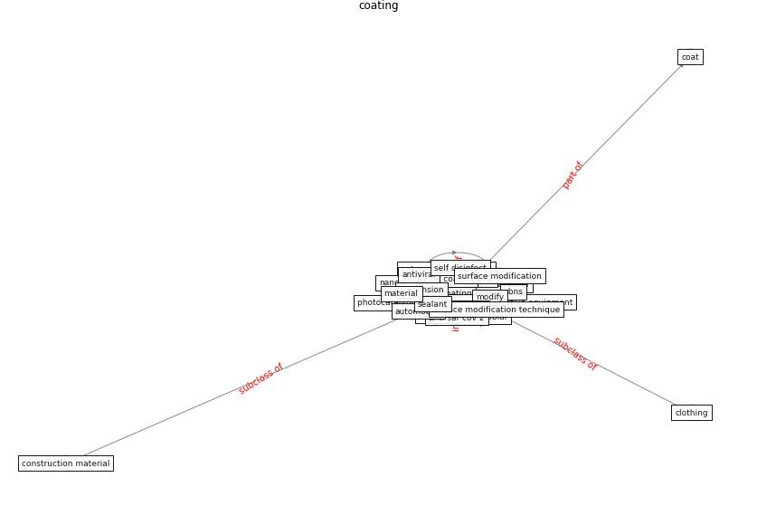

# Keyword: coating

* [airport-coating](cluster_Cluster_3)

* [perpetuity-bioaerosol](cluster_Cluster_6)

## Keywords

 * Cluster_3, Cluster_6, adhesive, adhesive cover, anti sar cov 2, anti viral, antibacterial, [antimicrobial](keyword_antimicrobial), [antiviral](keyword_antiviral), automobile, clothing, coat, [coating](keyword_coating), coatings, cold spray, cold spray process, construction material, [copper](keyword_copper), copper coat, cross section, finish, gbns, [graphene](keyword_graphene), material, modify, nanomaterial, paint, photocatalytic oxidation, polish, polymeric material, porosity, [sar cov 2](keyword_sar_cov_2), sealant, self disinfect, [stainless steel](keyword_stainless_steel), surface modification, surface modification technique, suspension

## Concepts

 

## Neighbours

### Closest articles

* Graphene-based nanomaterials as antimicrobial surface coatings: A parallel approach to restrain the expansion of COVID-19 - [LINK](article_ayub_graphene-based_2021)
* Sars-CoV-2 (COVID-19) inactivation capability of copper-coated touch surface fabricated by cold-spray technology - [LINK](article_hutasoit_sars-cov-2_2020)
* Designing Post COVID-19 Buildings: Approaches for Achieving Healthy Buildings - [LINK](article_navaratnam_designing_2022)
* Indoor Air Quality: Rethinking rules of building design strategies in post-pandemic architecture - [LINK](article_megahed_indoor_2021)
* Assessment method for new sustainability indicators providing pandemic resilience for residential buildings - [LINK](article_tokazhanov_assessment_2021)
* How is COVID-19 Experience Transforming Sustainability Requirements of Residential Buildings? A Review - [LINK](article_tokazhanov_how_2020)
* A Continuously Active Antimicrobial Coating effective against Human Coronavirus 229E - [LINK](article_ikner_continuously_2020)
* A Review on Building Design as a Biomedical System for Preventing COVID-19 Pandemic - [LINK](article_amran_review_2022)
* Smart buildings: how a virus might lead to healthier buildings - Arup - [LINK](article_lam_smart_2021)

### Closest BPs

