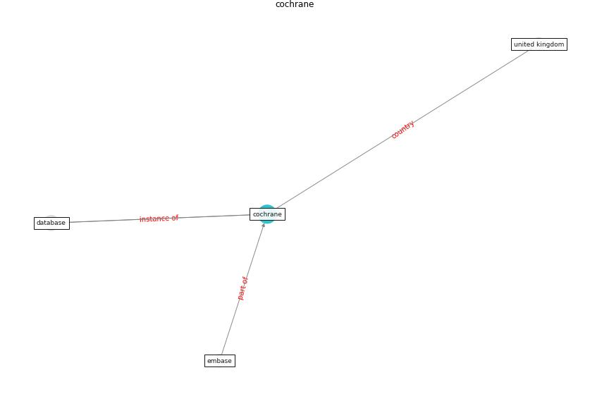

# Keyword: __cochrane__
## Clusters

* Cluster 14: [onlinelibrary-wiley](cluster_14)

## Concepts

 

## Articles
* Physical interventions to interrupt or reduce the spread
of respiratory viruses: systematic review ([jefferson_physical_2008](article_jefferson_physical_2008))
* Future perspectives of wastewater-based epidemiology:
Monitoring infectious disease spread and resistance to
the community level ([sims_future_2020](article_sims_future_2020))
* COVID-19 Prevention and Control Measures in
Workplace Settings: A Rapid Review and
Meta-Analysis ([ingram_covid-19_2021](article_ingram_covid-19_2021))
* Coronavirus disease 2019: The harms of exaggerated
information and non‐evidence‐based measures ([ioannidis_coronavirus_2020](article_ioannidis_coronavirus_2020))
* Supporting Technologies for COVID-19 Prevention:
Systemized Review ([zhao_supporting_2022](article_zhao_supporting_2022))
* Assessment of Building Automation and Control
Systems in Danish Healthcare Facilities in the
COVID-19 Era ([pedersen_assessment_2022](article_pedersen_assessment_2022))
* Digital Twin of COVID-19 Mass Vaccination
Centers ([pilati_digital_2021](article_pilati_digital_2021))
* COVID-19 Experience Transforming the Protective
Environment of Office Buildings and Spaces ([phapant_covid-19_2021](article_phapant_covid-19_2021))
* Mental Health and the Covid-19 Pandemic ([pfefferbaum_mental_2020](article_pfefferbaum_mental_2020))
* How our homes impact our health: using a COVID-19
informed approach to examine urban apartment housing ([peters_how_2020](article_peters_how_2020))
