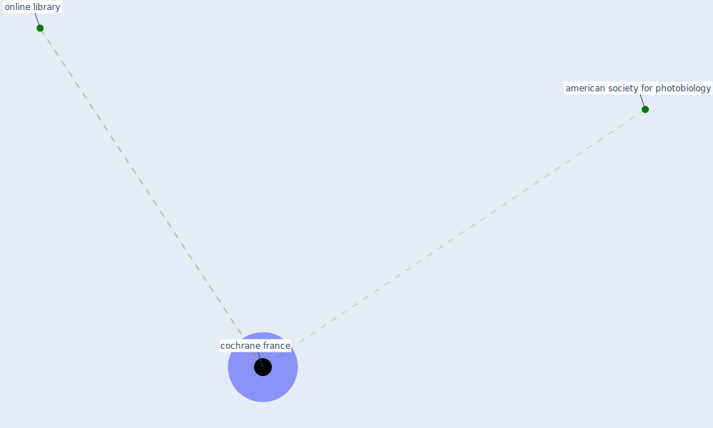

# Keyword: cochrane france

## Keywords

 * american society for photobiology, [cochrane france](keyword_cochrane_france), [online library](keyword_online_library)

## Mapping

## Neighbours

### Closest articles

* 10 Adaptive Measures for Public Places to face the COVID 19 Pandemic Outbreak - [LINK](article_cheshmehzangi_10_2020)
* Coronavirus disease 2019: The harms of exaggerated information and non‐evidence‐based measures - [LINK](article_ioannidis_coronavirus_2020)
* Air Disinfection for Airborne Infection Control with a Focus on COVID‐19: Why Germicidal UV is Essential             † - [LINK](article_nardell_air_2021)

### Closest BPs

