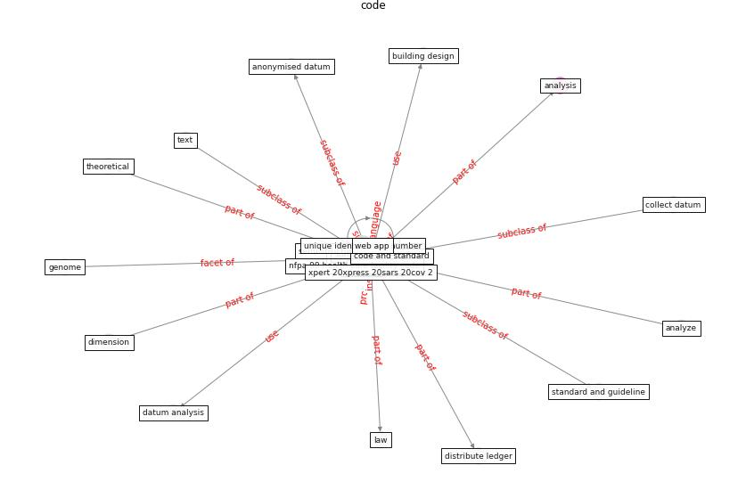

# Keyword: __code__
## Clusters

* Cluster 6: [building-guidance](cluster_6)

## Concepts

 

## Articles
* Influence between COVID-19 Impacts and Project
Stakeholders in Chilean Construction Projects ([araya_influence_2021](article_araya_influence_2021))
* Startups in times of crisis – A rapid response to the
COVID-19 pandemic ([kuckertz_startups_2020](article_kuckertz_startups_2020))
* Management of the COVID-19 pandemic: challenges,
practices, and organizational support ([hossny_management_2022](article_hossny_management_2022))
* hmc_architects_how_2020 ([hmc_architects_how_2020](article_hmc_architects_how_2020))
* rozgus_will_2020 ([rozgus_will_2020](article_rozgus_will_2020))
* Design COVID-19 Ontology: A Healthcare and
Safety Perspective ([aloulou_design_2022](article_aloulou_design_2022))
* nassereddine_propositions_2021 ([nassereddine_propositions_2021](article_nassereddine_propositions_2021))
* How the 5G Enabled the COVID-19 Pandemic
Prevention and Control: Materiality, Affordance,
and (De-)Spatialization ([li_how_2022](article_li_how_2022))
* Ventilation use in nonmedical settings during COVID-19:
Cleaning protocol, maintenance, and recommendations ([nembhard_ventilation_2020](article_nembhard_ventilation_2020))
* A Mixed Approach on Resilience of Spanish
Dwellings and Households during COVID-19 Lockdown ([cuerdo-vilches_mixed_2020](article_cuerdo-vilches_mixed_2020))
