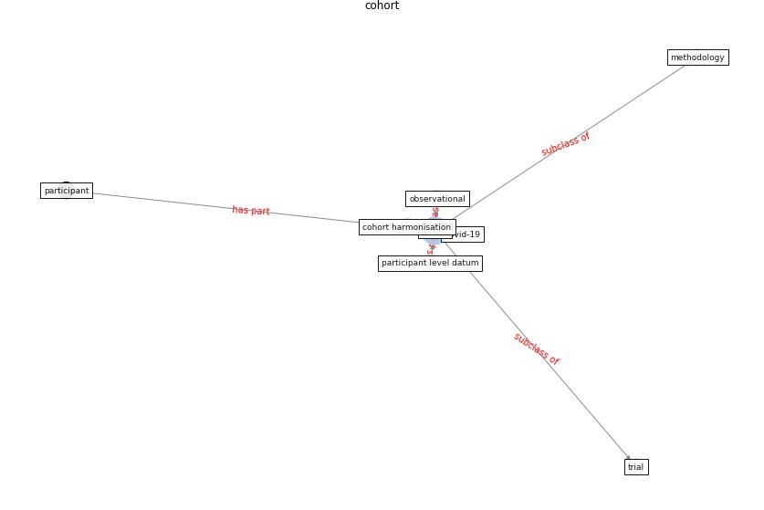

# Keyword: __cohort__
## Clusters

* Cluster 1: [om-ai](cluster_1.md)

## Concepts

 

## Articles
* Challenges of data sharing in European Covid-19
projects: A learning opportunity for advancing pandemic
preparedness and response ([tacconelli_challenges_2022](article_tacconelli_challenges_2022.md))
* Challenges of data sharing in European Covid-19
projects: A learning opportunity for advancing pandemic
preparedness and response ([tacconelli_challenges_2022](article_tacconelli_challenges_2022.md))
* Prophylactic Architecture: Formulating the Concept
of Pandemic-Resilient Homes ([elrayies_prophylactic_2022](article_elrayies_prophylactic_2022.md))
* Physical interventions to interrupt or reduce the spread
of respiratory viruses: systematic review ([jefferson_physical_2008](article_jefferson_physical_2008.md))
* realdania_refleksioner_2022_EN-1100 ([realdania_refleksioner_2022_EN-1100](article_realdania_refleksioner_2022_EN-1100.md))
* realdania_refleksioner_2022_EN-1450 ([realdania_refleksioner_2022_EN-1450](article_realdania_refleksioner_2022_EN-1450.md))
* realdania_refleksioner_2022_EN-1400 ([realdania_refleksioner_2022_EN-1400](article_realdania_refleksioner_2022_EN-1400.md))
* realdania_refleksioner_2022_EN-1350 ([realdania_refleksioner_2022_EN-1350](article_realdania_refleksioner_2022_EN-1350.md))
* realdania_refleksioner_2022_EN-1300 ([realdania_refleksioner_2022_EN-1300](article_realdania_refleksioner_2022_EN-1300.md))
* realdania_refleksioner_2022_EN-1250 ([realdania_refleksioner_2022_EN-1250](article_realdania_refleksioner_2022_EN-1250.md))
