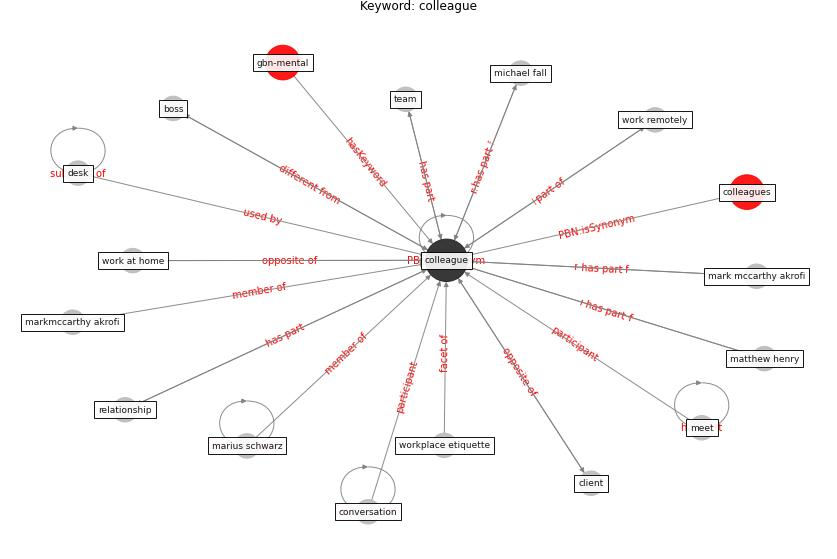

# Keyword: colleague

* [gbn-mental](cluster_Cluster_0)

## Keywords

 * Cluster_0, boss, client, [colleague](keyword_colleague), colleagues, conversation, [desk](keyword_desk), marius schwarz, mark mccarthy akrofi, markmccarthy akrofi, matthew henry, meet, michael fall, relationship, [team](keyword_team), work at home, work remotely, workplace etiquette

## Concepts

 

## Neighbours

### Closest articles

* Contextualizing the Covid-19 pandemic for a carbon-constrained world: Insights for sustainability transitions, energy justice, and research methodology - [LINK](article_sovacool_contextualizing_2020)
* Health, Wellbeing \& Productivity in Offices - [LINK](article_world_green_building_council_health_2014)
* Propositions for a Resilient, Post-COVID-19 Future for the AEC Industry - [LINK](article_nassereddine_propositions_2021)
* How the Coronavirus Will Reshape Architecture - [LINK](article_chayka_how_2020)

### Closest BPs

