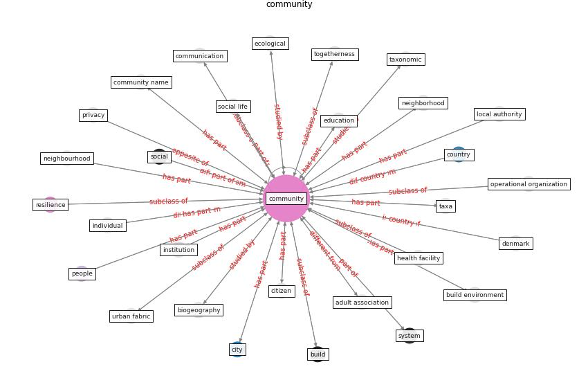

# Keyword: __community__
## Clusters

* Cluster 9: [resilience-infrastructure](cluster_9)

## Concepts

 

## Articles
* realdania_refleksioner_2022_EN ([realdania_refleksioner_2022_EN](article_realdania_refleksioner_2022_EN))
* who_strengthening_2017 ([who_strengthening_2017](article_who_strengthening_2017))
* Navigating Climate Change: Rethinking the Role of
Buildings ([cole_navigating_2020](article_cole_navigating_2020))
* Architectural Design Drives the Biogeography of
Indoor Bacterial Communities ([kembel_architectural_2014](article_kembel_architectural_2014))
* oecd_guidelines_2014 ([oecd_guidelines_2014](article_oecd_guidelines_2014))
* Treating two pandemics for the price of one: Chronic and
infectious disease impacts of the built and natural
environment ([frank_treating_2021](article_frank_treating_2021))
* Revisiting the built environment: 10 potential development
changes and paradigm shifts due to COVID-19 ([cheshmehzangi_revisiting_2021](article_cheshmehzangi_revisiting_2021))
* Adaptive Design of the Built Environment to
Mitigate the Transmission Risk of COVID-19 ([ara_dilshad_shangi_adaptive_2020](article_ara_dilshad_shangi_adaptive_2020))
* Assessment method for new sustainability indicators
providing pandemic resilience for residential buildings ([tokazhanov_assessment_2021](article_tokazhanov_assessment_2021))
* Towards Resilient Residential Buildings and
Neighborhoods in Light of COVID-19 Pandemic—The
Scenario of Podgorica, Montenegro ([bojovic_towards_2022](article_bojovic_towards_2022))
